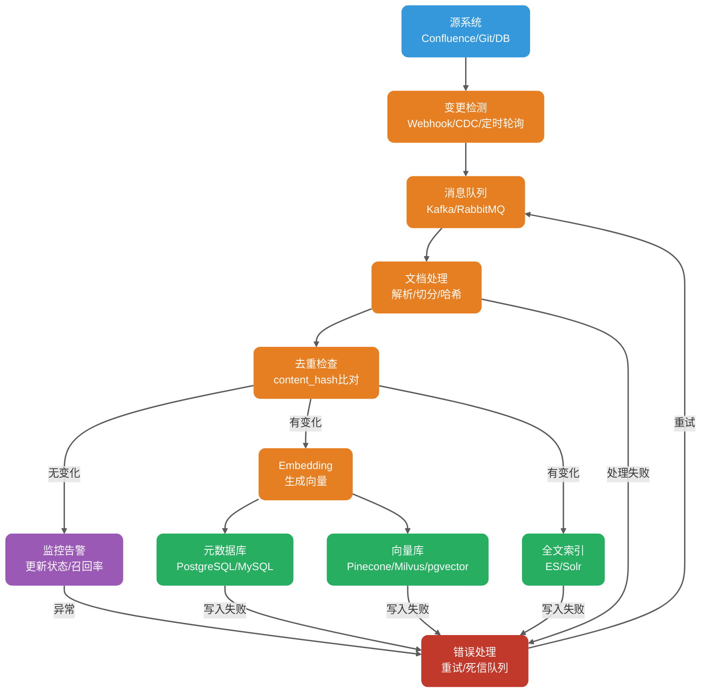
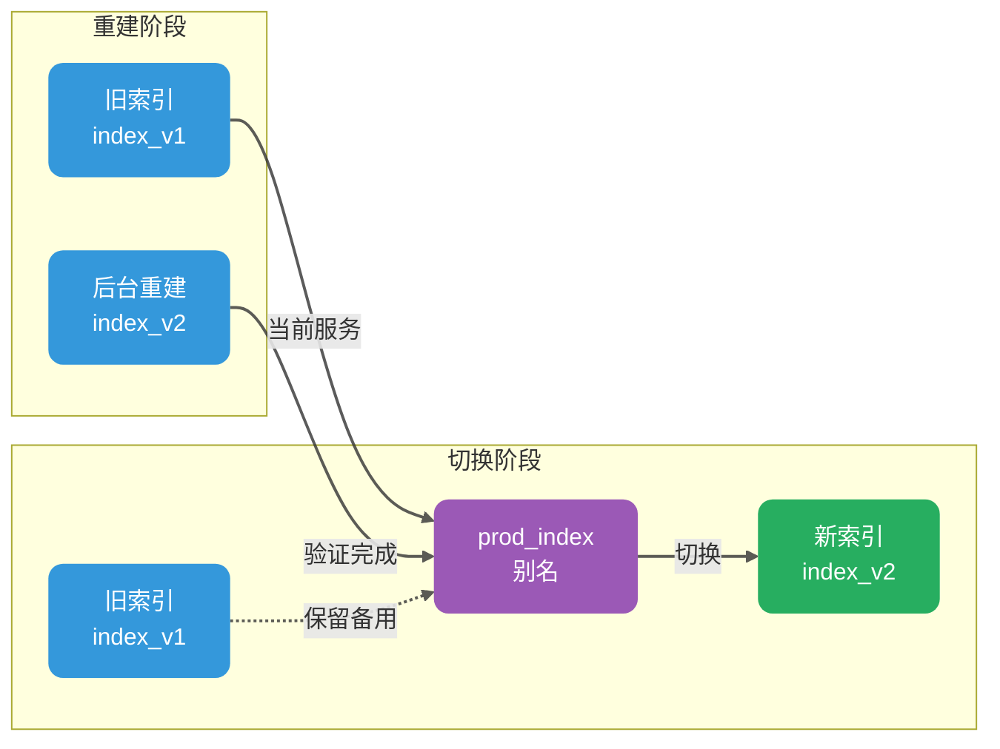

<!-- @include: @article-header.snippet.md -->

上线第一个企业知识库 RAG 系统之后，很多团队都会遇到一个很现实的问题：**文档更新了，但回答还是老样子。**

问题通常不在 LLM，而在知识库没同步更新。更麻烦的是，当文档变更频繁时，是每次都全量重建索引，还是只更新变化的部分？只插入新向量、不清理旧版本，会不会导致过期 chunk 被继续召回？换了一个 embedding 模型，历史数据要不要全部重索引？

这些问题，说到底是 RAG 知识库**动态性、准确性、一致性、可回滚、可观测**这五件事没解决好。

今天这篇文章就来系统梳理 RAG 知识库更新的工程实践，帮你搞清楚每个环节的核心问题。本文接近 1.3w 字。

1. **核心目标**：知识库更新要解决哪些核心问题？为什么 embedding 模型一致性是第一铁律？
2. **元数据设计**：如何设计支持增量更新、版本回滚和幂等写入的元数据体系？
3. **同步机制**：文档新增、修改、删除如何同步到向量库、全文索引和元数据库？
4. **更新策略**：增量更新和全量重建各自的适用场景、优缺点，以及生产环境的推荐策略。
5. **生产级实践**：灰度发布、失败重试、幂等更新、回滚机制怎么落地？
6. **常见坑点**：知识库更新过程中的常见问题，以及如何提前规避。

## 知识库更新要解决哪些核心问题？

在聊具体技术方案之前，先把目标理清楚。

做知识库更新，核心要解决的不是“怎么写代码”，而是“怎么保证更新之后，系统回答还是准的、快的、不会越权的”。

**动态性**：文档变了，索引要能及时跟上。这个“及时”可以是秒级，也可以是天级，取决于业务对实时性的要求。

**准确性**：更新后召回的文档要和更新后的文档内容一致，不能张冠李戴。

**一致性**：同一个文档的不同版本、向量库和元数据库、索引和全文检索之间，要保持数据一致。

**可回滚**：出了故障能快速切回上一个健康状态，而不是束手无策。

**可观测**：更新过程要能监控、更新结果要能评估、失败原因要能定位。

这五个目标听起来像常识，但 Guide 在实际项目中见过太多团队只做了第一步“更新”，后面四个全靠“祈祷”。结果就是文档改了十版，回答还是第一版；删了一篇敏感文档，过了三个月还有人能召回出来。

## 为什么 Embedding 模型必须保持一致？

这一节要反复强调：**索引时用的 embedding 模型，必须和查询时用的模型完全一致。**

Embedding 模型把文本转成向量，不同模型的向量空间完全不同。一句话用 OpenAI 的 text-embedding-3-small 编码，和用 sentence-transformers 的 all-MiniLM-L6-v2 编码，得到的向量在数值上没有任何可比性。如果索引用模型 A，查询用模型 B，就等于在两个完全不相干的向量空间里做相似度比较。具体表现取决于向量维度是否一致：**如果维度不同，通常无法在同一索引中检索**，很多向量库会直接拒绝插入不匹配维度的向量；**如果维度相同但模型不同，相似度分数不具备可比性，召回结果不可依赖**，而非单纯的“随机”。

这个结论看起来简单，但实际生产中很容易被忽视的场景有两个：

**场景一：模型升级**。业务方觉得新模型效果好，要切换到 text-embedding-3-large。这意味着所有历史数据必须重新编码、重新入索引。工程上可以通过**双索引并行 + 灰度切流**降低迁移风险，但核心工作无法绕过。

**场景二：混用本地模型和 API 模型**。测试环境用本地 sentence-transformers，生产环境用 OpenAI API。这种差异在团队协作时尤其容易出现——测试没问题，上线才发现召回率腰斩。

生产环境推荐的做法是：**把 embedding 模型版本写入元数据**，每次查询时校验模型版本是否匹配。如果不匹配，要么拒绝查询，要么返回警告日志并降级到更保守的召回策略。

| 字段                      | 说明     | 示例                     |
| ------------------------- | -------- | ------------------------ |
| `embedding_model`         | 模型名称 | `text-embedding-3-large` |
| `embedding_model_version` | 模型版本 | `2025-01-15`             |
| `embedding_dimension`     | 向量维度 | `3072`                   |

当 embedding 模型需要升级时，推荐的流程是：

1. 在新索引中用新模型重建所有数据。
2. 新旧索引并行运行一段时间，对比召回率和回答质量。
3. 确认新索引表现稳定后，通过**索引别名切换**将流量切到新索引。
4. 保留旧索引一段时间，用于快速回滚。
5. 确认无问题后，删除旧索引。

这个流程的核心思路和数据库蓝绿部署完全一样——不是原地修改，而是新建一套，验证后切换。

## 如何设计支持更新的元数据体系？

好的元数据设计是增量更新的前提。Guide 见过很多 RAG 系统跑着跑着就“失忆”了——知道文档内容，但不知道这条向量对应哪个文档、哪个版本、什么时候入库的。

每个 Chunk 至少应该携带以下元数据：

```json
{
  "doc_id": "doc-uuid-001",
  "chunk_id": "chunk-uuid-001",
  "content_hash": "sha256:abc123...",
  "version_id": 3,
  "chunk_strategy": "semantic",
  "chunk_size": 512,
  "chunk_overlap": 50,
  "source_id": "confluence-page-123",
  "source_type": "confluence",
  "title": "订单中心接口文档",
  "section_path": "技术文档 / 订单系统 / 接口规范",
  "page": 5,
  "tenant_id": "tenant-001",
  "acl": ["role:admin", "team:order-team"],
  "created_at": "2025-03-01T10:00:00Z",
  "updated_at": "2025-04-15T14:30:00Z",
  "embedding_model": "text-embedding-3-large",
  "embedding_model_version": "2025-01-15",
  "embedding_dimension": 3072,
  "is_deleted": false
}
```

> **说明**：Chunk 策略（切分方式、重叠率、解析方式）也需要版本化，和 embedding 模型变更一样，应触发重建或双索引灰度。记录 `chunk_strategy`、`chunk_size`、`chunk_overlap` 等字段便于后续评估和回滚。

重点解释几个关键字段：

**`content_hash`**（内容哈希）是增量更新的核心。它不是文件哈希，而是文档正文的哈希值。常用的算法有：

- **MD5**：速度快，但存在碰撞风险，适合对碰撞不敏感的场景。
- **SHA-256**：碰撞风险极低，推荐使用。
- **SimHash**：适合判断内容是否“大致相同”，常用于网页去重。但它不能精确定位具体变化点。

生产环境中，`content_hash` 的主要作用是判断“这段文本有没有变”。入库时计算哈希，和数据库中已有记录的哈希对比。如果一致，说明内容没变，跳过 embedding；如果不一致，说明内容变了，需要重新编码。

**`version_id`**（版本号）记录文档被修改了多少次。每次文档更新，`version_id` 加一。这个字段配合 `content_hash` 使用，可以精确追踪文档的变更历史。

**`is_deleted`**（软删除标记）是一个高频踩坑点。很多团队做文档删除时，直接从向量库中把记录删掉。但如果在删除前没有记录这个“删除事件”，当同一篇文档再次上传时，系统无法判断这是“新文档”还是“历史文档的重新上传”。加了 `is_deleted` 标记后，处理逻辑变成：

1. 收到文档删除事件时，将 `is_deleted` 设为 `true`。
2. 收到文档重新上传事件时，将 `is_deleted` 设为 `false`，并重新计算 `content_hash`。
3. 查询时默认**只保留** `is_deleted = false` 的记录。

软删除不只是为了区分“新文档还是历史文档重新上传”，更是给审计、误删恢复、延迟物理删除、跨系统一致性留缓冲窗口。

**`tenant_id` 和 `acl`** 是多租户和权限控制的基础。查询时**优先**在检索阶段做租户和粗粒度 ACL 预过滤，避免无权限文档占用 Top-K 位置影响召回质量。对复杂权限（如动态权限、跨租户继承），可以在返回引用前做二次鉴权，避免越权引用。

## 新增、修改、删除文档如何同步？

文档从源系统到向量库，中间经过多个环节。任何一个环节出问题，都会导致数据不一致。



> **部分成功场景的处理**：向量库、元数据库、全文索引通常不在同一事务域，一次性写三端可能出现部分成功。建议以元数据库为 source of truth，记录每个 chunk 的索引状态（如 `index_status = 'ready' / 'partial_failed'`）。后台补偿任务定期重试失败端，定期 reconciliation 扫描差异。

### 新增文档

新增是三种操作中最简单的：

1. 解析文档，提取正文、标题、层级结构。
2. 按既定策略切分 Chunk。
3. 计算每个 Chunk 的 `content_hash`。
4. 检查哈希是否已存在于元数据库——如果存在，跳过（幂等保证）。
5. 对每个 Chunk 调用 embedding 模型生成向量。
6. 写入向量库、元数据库、全文索引。

幂等性是关键。新增操作必须设计成可重复执行的。即使消息队列重复投递同一条消息，或者 worker 崩溃重启后重试，结果应该是相同的——不会产生重复记录。

### 修改文档

修改比新增复杂，核心问题是：**旧版本的数据怎么办？**

Guide 推荐的做法是：软删除 + 写入新版：

1. 根据 `doc_id` 查询元数据库，找到旧版本的 `chunk_id` 列表。
2. 将这些旧 chunk 标记为 `is_deleted = true`，或者直接物理删除。
3. 写入新版本的 chunk 和向量。

如果向量库支持基于主键的原子更新操作（如 Milvus 的 upsert），可以直接覆盖同一主键的记录。但需要注意：**upsert 只能覆盖同一主键实体**。如果文档重新切分后 chunk 数量或 chunk_id 变化，仍需要按 `doc_id + version_id` 清理旧版本残留。如果不支持原子更新，需要分两步走：先删旧记录，再写新记录。两步之间存在一个极短的时间窗口，期间查询可能同时命中新旧两条记录。

**一个容易踩的坑是：只写新向量，不删旧向量。**

Guide 见过不止一个项目这样出问题：文档被修改了 10 版，向量库里存了 10 个版本的向量。用户查询时，最匹配的反而可能是第 3 版的旧内容，模型基于过时信息给出错误答案。所以修改操作必须包含删除旧向量这一步，否则知识库会持续“失真”。

### 删除文档

删除分为软删除和物理删除：

**软删除**：将 `is_deleted` 标记设为 `true`。这是推荐做法，因为保留了变更历史，支持“误删恢复”。

**物理删除**：从向量库、元数据库、全文索引中彻底移除记录。建议在软删除后等待一段时间（如 30 天），确认没有问题再执行物理删除。

> **软删除与物理删除的取舍**：软删除便于恢复和审计，但会增加存储成本和过滤开销；物理删除更彻底，适合合规删除、敏感数据删除，但恢复成本高。推荐采用「软删除 + 延迟物理删除 + 删除审计日志」组合。对敏感文档，还应补充清理缓存（rerank 缓存、LLM 上下文缓存）。

删除操作还有一个隐蔽的坑：**权限变更后的“幽灵数据”**。假设一篇文档原本所有员工可见，后来被标记为“仅高管可见”。如果向量库中旧的 `acl` 元数据没有被更新，普通员工查询时可能仍然能召回这篇文档——因为向量检索在元数据过滤之前就已经完成了。

正确的做法是：权限变更需要触发文档的重新索引，确保元数据中的 `acl` 字段是最新的。如果向量库支持原子更新 ACL 字段，可以在不重建向量的情况下更新元数据。

## 增量更新和全量重建各适合什么场景？

这是生产环境中最常被问到的问题。Guide 在实际项目中的结论是：**大多数场景下，增量更新是日常，配合定期全量重建才是稳态。**

| 维度       | 增量更新             | 全量重建                                     |
| ---------- | -------------------- | -------------------------------------------- |
| 触发条件   | 文档变更事件         | 定时任务或手动触发                           |
| 覆盖范围   | 仅变化的文档         | 整个知识库                                   |
| 计算成本   | 低，只处理变化部分   | 高，需要处理全部数据                         |
| 更新延迟   | 低，可近实时         | 高，可能需要数小时                           |
| 数据一致性 | 依赖变更检测准确性   | 需基于源系统快照或版本时间戳保证与源系统一致 |
| 适用场景   | 日常变更、高频更新   | 模型升级、策略调整、故障恢复                 |
| 主要风险   | 变更漏检导致数据陈旧 | 重建期间服务不可用                           |

### 增量更新的适用场景

- 文档变更频率适中（每天几十到几百次）。
- 对实时性有一定要求（分钟级更新可接受）。
- 知识库规模较大（全量重建成本高）。

增量更新的核心依赖是**变更检测机制**。常见方案有：

1. **Webhook / 事件驱动**：源系统（Confluence、Git、数据库）提供变更通知，RAG 系统订阅并处理。延迟最低，但需要源系统支持。
2. **CDC（Change Data Capture）**：监听数据库 binlog 或变更日志，捕获数据变化。适合结构化数据源。
3. **定时轮询**：按固定间隔（如每 5 分钟）扫描源系统，对比 `updated_at` 时间戳。实现简单，但有延迟，且对源系统有一定压力。

生产环境推荐第一种和第三种组合：**事件驱动处理增量，轮询兜底防止漏检**。消息队列（Kafka、RocketMQ）作为缓冲，解耦源系统和 RAG 处理流程。

### 全量重建的适用场景

- **Embedding 模型升级**。这是最硬的需求，无法绕过。
- **Chunk 策略调整**。比如从固定 500 Token 改为语义切分，历史数据需要按新策略重新切分。
- **数据结构变更**。新增或修改了元数据字段。
- **严重故障恢复**。增量链路长期失灵，数据严重陈旧。
- **定期健康维护**。部分向量库在高频删除后可能产生 tombstone 删除标记、索引碎片或召回退化，积累会影响召回率。全量重建可以彻底清理这些残留。具体表现因索引类型和产品实现而异（如基于 HNSW + tombstone 清理机制的产品），建议查阅所用向量库的文档确认。

全量重建的核心问题是**服务中断**。推荐做法是使用**索引别名切换**：



具体步骤：

1. 查询服务通过索引别名 `prod_index` 访问，旧索引为 `index_v1`。
2. 后台启动重建任务，构建新索引 `index_v2`。
3. 新索引验证通过后，将别名 `prod_index` 指向 `index_v2`。这一步通常可以做到秒级完成，Milvus / Zilliz 的 alias 机制支持在 collection 间切换；但其他向量库是否支持同等能力需单独确认。
4. 保留旧索引 `index_v1` 一段时间（如 7 天），用于快速回滚。
5. 确认无问题后，删除旧索引。

### 生产推荐的稳态策略

Guide 在多个生产项目中验证过的策略是：**实时增量 + 定期全量重建 + 事件驱动的紧急重建**。

- **实时增量**：通过 Webhook 或 CDC 捕获变更事件，近实时更新向量库。
- **定期全量重建**：每周或每月执行一次全量重建，清理残留数据、修正累积误差、确保数据完整性。
- **事件驱动的紧急重建**：当检测到严重问题时（如模型升级、策略变更、大规模权限调整），立即触发针对性重建。

这个组合兼顾了实时性和长期健康。

## 如何让更新链路稳定可靠？

### 幂等更新：消息队列的好搭档

消息队列天然存在重复投递的问题。网络抖动、consumer 崩溃重启、offset 未提交，都会导致消息被重复消费。

幂等更新的核心是**去重依据**。最可靠的方案是基于 `doc_id` + `content_hash` 联合去重，但需要注意并发安全。简单的“先查再写”无法保证并发场景下的最终一致性，两条相同或乱序消息同时到达时仍可能互相覆盖、重复写入。推荐的幂等实现方式：

1. **依赖唯一约束**：以 `doc_id + content_hash` 或 `doc_id + version_id` 建唯一索引，插入时让数据库拒绝重复。
2. **乐观锁 / 分布式锁**：在写入新版本前获取锁，防止并发覆盖。
3. **事务 outbox**：变更事件先写入 outbox 表，再由消费者幂等处理。

以下是基于唯一约束的实现示例：

```python
def process_document_change(event):
    doc_id = event['doc_id']
    content = event['content']
    version_id = event.get('version_id', 1)
    chunk_hash = compute_hash(content)

    # 基于 doc_id + chunk_hash 构造唯一 chunk_id（确定性）
    chunk_id = f"{doc_id}_{version_id}_{compute_hash(content[:100])}"

    # 尝试插入，利用数据库唯一约束幂等
    try:
        db.execute("""
            INSERT INTO chunks (doc_id, chunk_id, content_hash, version_id, is_deleted)
            VALUES (:doc_id, :chunk_id, :content_hash, :version_id, false)
            ON CONFLICT (doc_id, chunk_id) DO NOTHING
        """, {
            'doc_id': doc_id,
            'chunk_id': chunk_id,
            'content_hash': chunk_hash,
            'version_id': version_id
        })
        # 只有插入成功才继续处理（冲突说明内容未变）
        if db.rowcount == 0:
            logger.info(f"Doc {doc_id} already exists, skipping")
            return

        # 生成向量并写入
        embedding = embedding_model.encode(content)
        vector_db.upsert(doc_id, chunk_id, embedding, {
            'doc_id': doc_id,
            'content_hash': chunk_hash,
            'version_id': version_id,
            'updated_at': now()
        })
    except Exception as e:
        logger.error(f"Failed to process {doc_id}: {e}")
        raise
```

这段代码的关键是：**利用数据库唯一约束保证幂等**，而不是先查再写。即使在并发场景下两条消息同时到达，数据库也会拒绝重复插入，而不是覆盖对方刚写的新版本。

### 乱序事件处理

消息队列投递的顺序并不总是一致的，RAG 更新链路中先收到 v3 再收到 v2 很常见。乱序处理不当会导致旧版本覆盖新版本。

推荐的解决思路：

1. **携带版本标识**：每个文档事件带 `source_version`、`updated_at` 或单调递增的 `revision`，用于判断新旧。
2. **只允许新版本覆盖旧版本**：写入前校验 `event.version >= current_version`，旧事件到达直接丢弃或写入审计日志。
3. **对同一 doc_id 做分区有序消费**：例如 Kafka key 使用 `doc_id`，保证同一文档的消息在同一 partition 内有序。
4. **乱序丢弃打点**：监控被丢弃的乱序事件数量，便于发现源系统事件异常。

处理链路的任何一个环节都可能失败：网络抖动、API 限流、向量库暂时不可用。

推荐的策略是**指数退避重试 + 死信队列兜底**：

```python
def process_with_retry(event, max_retries=3):
    for attempt in range(max_retries):
        try:
            process_document_change(event)
            return  # 成功，直接返回
        except TransientError as e:
            wait_time = 2 ** attempt  # 指数退避：2s, 4s, 8s
            logger.warning(f"Attempt {attempt + 1} failed: {e}, retrying in {wait_time}s")
            time.sleep(wait_time)
        except PermanentError as e:
            # 永久性错误（如格式错误），不重试，直接打入死信队列
            logger.error(f"Permanent error, sending to DLQ: {e}")
            dlq.send(event, reason=str(e))
            return

    # 超过最大重试次数，打入死信队列并告警
    logger.error(f"Max retries exceeded for {event['doc_id']}")
    dlq.send(event, reason="max_retries_exceeded")
    alert.trigger(f"Document update failed after {max_retries} retries: {event['doc_id']}")
```

重试的分类很重要。**瞬时错误**（网络超时、API 限流）应该重试；**永久错误**（格式错误、字段缺失）不应该重试，因为重试多少次都不会成功，只会浪费资源。

死信队列（DLQ）中的消息需要人工介入处理。建议每周 Review 一次 DLQ，修复问题后重新投递。

### 回滚机制：出问题时的救命稻草

回滚不是“后悔药”，而是“应急通道”。好的回滚机制应该让操作者在任何时候都能快速切回上一个健康状态。

根据不同场景，回滚方案也不同：

**索引别名切换的回滚**：最简单。别名切换后，如果新索引有问题，把别名指回旧索引即可。前提是旧索引还没被删除。

**模型升级的回滚**：在升级前记录旧模型的 `model_name` 和 `model_version`。如果新模型表现异常，切换回旧模型，同时触发基于旧模型的全量重建。

**数据版本回滚**：当需要回滚到某个特定时间点的数据状态时，可以利用 `updated_at` 和 `version_id` 字段。保留历史快照（可以是向量库的 snapshot，或者独立的对象存储），在需要时恢复。

**权限回滚**：如果权限变更导致数据泄露，第一步是**立即阻断受影响范围**：下线相关知识库或租户检索入口、禁用问题索引、强制引用前鉴权。只有无法界定影响面时才全局停服。

```python
def rollback_to_version(target_version_id):
    # 查询目标版本的快照
    snapshot = get_snapshot(version_id=target_version_id)
    if not snapshot:
        raise ValueError(f"No snapshot found for version {target_version_id}")

    # 停止服务
    service.set_status('maintenance')

    # 恢复快照
    vector_db.restore(snapshot)

    # 重启服务
    service.set_status('active')

    # 发送告警
    alert.trigger(f"System rolled back to version {target_version_id}")
```

### 灰度发布：新策略先小流量验证

和 APP 灰度发布一样，知识库更新策略也应该先小流量验证，再全量铺开。

常见的灰度策略：

1. **按文档数量灰度**：先更新 10% 的文档，观察召回率和回答质量。
2. **按用户灰度**：先让 5% 的用户看到新索引的查询结果，对比他们的满意度。
3. **按问题类型灰度**：某些问题类型（如精确查询）对索引变化更敏感，先小流量验证这些场景。

灰度期间的关键指标监控：

> **说明**：以下阈值是示例值，生产环境应基于历史基线、离线评估集和线上 A/B 结果校准后再使用，切勿直接照抄。

| 指标                          | 含义                                 | 告警阈值   |
| ----------------------------- | ------------------------------------ | ---------- |
| `retrieval_hit_rate@10`       | 前 10 个召回结果中包含正确答案的比例 | 下降 > 5%  |
| `avg_answer_latency`          | 平均回答延迟                         | 上升 > 20% |
| `citation_accuracy`           | 引用准确性                           | 下降 > 3%  |
| `user_feedback_negative_rate` | 用户负面反馈率                       | 上升 > 2%  |

任何一个指标触发告警，都应该立即停止灰度，排查问题。

## 知识库更新有哪些常见坑？

### 坑一：只插入新向量，不删除旧向量

这是最常见的问题。文档被修改了 5 次，向量库里存了 5 个版本。用户查询时召回了旧版本，模型基于过时信息给出错误答案。

**解决思路**：修改文档时必须同时处理旧向量。可以在写入新向量之前，先根据 `doc_id` 清理旧记录。

### 坑二：Embedding 模型混用

索引用模型 A，查询用模型 B，向量空间完全不兼容。

**解决思路**：把 `embedding_model` 和 `embedding_model_version` 作为元数据的必填字段。查询前校验模型版本，不匹配则拒绝或降级。

### 坑三：Chunk 策略变了，但不重建历史数据

从固定长度切分改成语义切分，从 500 Token 改成 800 Token，但只对新文档生效，历史数据依然是旧策略。

**解决思路**：Chunk 策略变更必须触发全量重建。这不是增量能解决的事。

### 坑四：文档删除后仍被召回

软删除没做好，或者删除逻辑只处理了向量库，没处理全文索引。

**解决思路**：删除操作必须是三端一致：向量库、元数据库、全文索引都要同步处理。推荐使用 **outbox pattern** 记录变更事件，消费者幂等执行；再通过定期 **reconciliation** 对比源系统、元数据库、向量库、全文索引，修复漏删、漏写和乱序事件。

### 坑五：权限元数据不同步

文档权限从“公开”改成“仅管理员可见”，但向量库里的 `acl` 字段没更新。

**解决思路**：权限变更必须触发文档重新索引。如果向量库支持原子更新 ACL 字段，可以只更新元数据而不重建向量，但这要求向量库有相应能力。

### 坑六：变更检测漏检

Webhook 漏发、CDC 延迟、定时轮询间隔太大，都会导致文档变了但索引没变。

**解决思路**：事件驱动 + 轮询兜底。同时建立“数据新鲜度监控”，定期检查向量库中记录的最后更新时间，如果某篇文档在源系统中 `updated_at` 比向量库中的 `updated_at` 新超过阈值，就触发告警甚至自动重新索引。

## 如何保证知识库更新的可观测性？

知识库更新链路必须配套监控体系，否则就是“盲人骑瞎马”。

**关键监控指标**：

| 指标                          | 说明                                     | 推荐告警阈值     |
| ----------------------------- | ---------------------------------------- | ---------------- |
| `index_lag_seconds`           | 从文档变更到索引完成的时间               | > 5 分钟         |
| `failed_updates_total`        | 失败的更新操作累计数                     | > 0 持续 10 分钟 |
| `dlq_size`                    | 死信队列当前积压量                       | > 100            |
| `retrieval_hit_rate`          | 召回准确率                               | 环比下降 > 5%    |
| `stale_docs_count`            | 陈旧文档数量（源系统已更新但索引未更新） | > 10             |
| `source_to_queue_lag_seconds` | 源系统变更到事件入队延迟                 | > 1 分钟         |
| `queue_to_index_lag_seconds`  | 事件入队到索引完成延迟                   | > 5 分钟         |
| `index_success_rate`          | 索引成功率                               | < 99%            |
| `partial_index_count`         | 部分写入成功但未完成的文档数             | > 0 持续 30 分钟 |
| `acl_mismatch_count`          | 源系统 ACL 与索引 ACL 不一致数量         | > 0              |

**日志链路**：每次更新操作应该记录完整的审计日志，包括 `doc_id`、`change_type`（新增/修改/删除）、`timestamp`、`operator`（自动/手动）、`result`（成功/失败）、`error_message`。

这样出问题的时候，才能快速定位是哪条记录、哪个环节、什么时候出的问题。

## 总结

RAG 知识库更新不是“写个定时任务重新索引”这么简单。它涉及变更检测、数据一致性、幂等写入、版本控制、灰度发布、回滚机制、可观测性等多个工程环节。

核心结论：

1. **Embedding 模型一致性是第一铁律**。更换模型必须全量重建索引，没有取巧方案。
2. **元数据设计是增量更新的前提**。好的元数据（doc_id、content_hash、version_id、is_deleted）是实现幂等更新和版本回滚的基础。
3. **删除操作必须三端一致**：向量库、元数据库、全文索引都要同步处理。
4. **增量更新是日常，全量重建是周期性的健康维护**。两者配合使用。
5. **索引别名切换是生产级灰度发布的标准做法**。先建新索引，验证后切换，保留旧索引用于回滚。
6. **幂等 + 重试 + 死信队列**是保证更新链路可靠的三板斧。
7. **可观测性是更新的最后一道防线**。不知道更新了没有，等于没更新。

RAG 知识库的维护是长期投入，上线后才真正开始验证效果。

## 参考资料

- [How to Update RAG Knowledge Base Without Rebuilding Everything](https://particula.tech/blog/update-rag-knowledge-without-rebuilding)
- [RAG Knowledge Base Management: Updates & Refresh](https://apxml.com/courses/optimizing-rag-for-production/chapter-7-rag-scalability-reliability-maintainability/rag-knowledge-base-updates)
- [RAG in Practice: Versioning, Observability, and Evaluation in Production](https://pub.towardsai.net/rag-in-practice-exploring-versioning-observability-and-evaluation-in-production-systems-85dc28e1d9a8)
- [RAG in Production: Deployment Strategies & Practical Considerations](https://coralogix.com/ai-blog/rag-in-production-deployment-strategies-and-practical-considerations/)
- [23 RAG Pitfalls and How to Fix Them](https://www.nb-data.com/p/23-rag-pitfalls-and-how-to-fix-them)
- [Incremental Indexing Strategies for Large RAG Systems](https://medium.com/@vasanthancomrads/incremental-indexing-strategies-for-large-rag-systems-e3e5a9e2ced7)
- [RAG Series: Embedding Versioning with pgvector](https://www.dbi-services.com/blog/rag-series-embedding-versioning-with-pgvector-why-event-driven-architecture-is-a-precondition-to-ai-data-workflows/)
