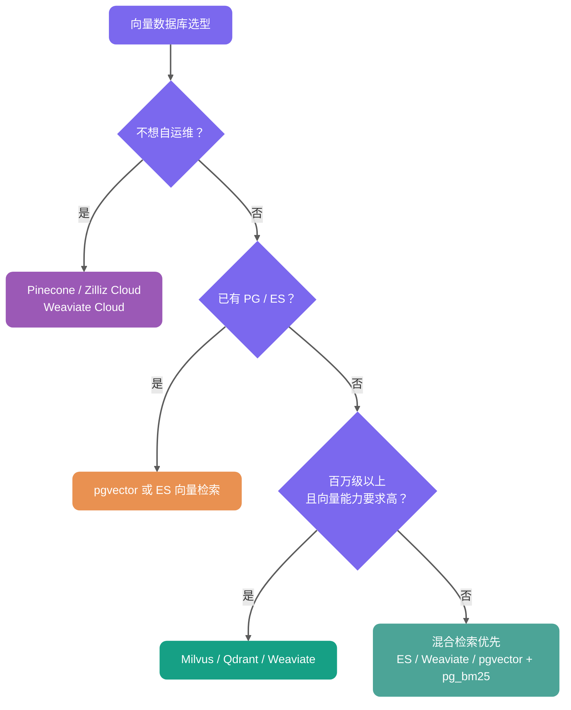

前段时间面某大厂的时候，面试官问我：“你们 RAG 系统的向量检索怎么做的？”，我说：“用 MySQL 存 Embedding，查询时遍历计算相似度。”

面试官的表情告诉我事情没那么简单——当时我们知识库有 50 多万条 Chunk，每次查询都要全表扫描，平均响应时间 3 秒+，用户早就跑光了。

后来才知道，这叫“暴力搜索”，而生产级方案应该是**向量数据库 + ANN 索引**。

向量存储和向量索引是大多数 RAG 应用的重要基础设施。当数据规模、延迟和召回要求上来后，向量数据库或带向量扩展的数据库基本绕不开。今天 Guide 分享几道向量数据库相关的面试题，希望对大家有帮助：

1. ⭐️ RAG 场景为什么需要向量数据库？
2. Embedding 和向量检索是什么关系？
3. 余弦距离、内积、欧氏距离有什么区别？
4. ⭐️ 什么是向量索引算法？
5. 有哪些向量索引算法？
6. ⭐️ 你的项目使用的什么向量索引算法？
7. HNSW 索引和 IVFFLAT 索引的区别是什么？
8. 有哪些向量数据库？
9. ⭐️ 你为什么选择 PostgreSQL + pgvector？
10. 为什么不选择 MySQL 搭配向量数据库呢？

## 先搞懂：Embedding 和向量检索是什么关系？

向量数据库不是直接理解文本，而是存储和检索 Embedding。

Embedding 的过程是：把一段文本交给 Embedding 模型，模型输出一个固定维度的稠密向量。这个向量可以粗略理解为“文本语义坐标”。如果两段文本语义接近，它们在向量空间里的距离通常也会更近。


因此，RAG 的向量检索链路可以简化为：

```text
文档 Chunk -> Embedding 模型 -> 文档向量 -> 写入向量数据库
用户问题 -> Embedding 模型 -> 查询向量 -> 检索最相似的 Top-K 文档向量
```

基础概念可以看 [RAG 基础篇](./rag-basis.md)，本文重点放在后半段：**这些向量如何高效存储、索引和检索**。

## ⭐️ RAG 场景为什么需要向量数据库？

RAG（Retrieval-Augmented Generation）的核心是“语义检索”——把文档和用户问题都转成高维向量（Embedding），然后找最相似的 Top-K 片段作为 LLM 上下文。

RAG 场景不只是“能不能存 Embedding”，真正的问题是：**能不能在大规模高维向量中，以低延迟找出最相关的 Top-K**。

传统关系型数据库可以存储向量，也可以通过函数或 SQL 表达式计算相似度，但如果没有专门的向量索引，通常只能全表扫描，难以支撑生产级低延迟检索。因此，当 Chunk 数量达到几十万、百万甚至更高时，就需要引入向量数据库、向量搜索引擎，或者 PostgreSQL + pgvector 这类带向量索引能力的数据库扩展。


### 1. 高维向量相似度搜索

Embedding 通常是 768~3072 维的稠密向量。没有向量索引时，即使数据库能通过函数或表达式计算“余弦相似度 / 内积 / 欧氏距离”，也很难在大规模数据上高效完成 Top-K 检索。

**暴力搜索**：如果强行用 SQL 遍历全表计算相似度，复杂度是 O(n)。以 100 万条 1024 维向量为例：

- 单次查询计算：1,000,000 × 1,024 次乘法运算
- 实际延迟：**秒级**（具体数值因硬件而异）

秒级延迟——对于需要实时响应的问答系统完全不可接受。

**ANN 近似检索**：向量数据库专为最近邻搜索（ANN, Approximate Nearest Neighbor）设计，通过图导航、空间划分或量化等方式减少距离计算次数。

ANN 的价值不在于“永远返回 100% 精确的最近邻”，而是在召回率、延迟和资源消耗之间做工程权衡。在合适的索引参数和硬件条件下，ANN 通常可以把百万级向量检索从秒级暴力扫描优化到几十毫秒甚至更低。但具体效果必须结合业务数据、Top-K、过滤条件、并发和召回率目标评测，不能只看理论复杂度。

| 指标     | 暴力搜索       | ANN 索引检索                     |
| -------- | -------------- | -------------------------------- |
| 检索方式 | 全量计算距离   | 只搜索候选集                     |
| 召回率   | 理论 100%      | 取决于索引类型和参数             |
| 延迟     | 数据量越大越慢 | 通常显著更低                     |
| 代价     | 计算开销高     | 需要构建索引，占用额外内存或磁盘 |

> 注：上表是工程上的数量级描述，实际性能因硬件规格、并发负载、数据分布、过滤条件、Top-K 和索引参数（如 `ef_search`、`nprobe`）而异，建议参考 [ann-benchmarks.com](https://ann-benchmarks.com) 并在目标业务环境验证。

### 2. 大规模数据承载能力

RAG 知识库动辄几十万 ~ 亿级 Chunk，向量数据库支持**亿级向量**持久化 + 增量更新 + 分片，而传统 DB 存向量后基本无法扩展。

### 3. 语义检索 vs 关键词检索的本质区别

| 检索方式         | 原理                     | 局限性                                        |
| ---------------- | ------------------------ | --------------------------------------------- |
| **BM25 关键词**  | 字面匹配，基于词频统计   | 遇到同义词/改写就失效（“退货” vs “退款流程”） |
| **向量语义搜索** | Embedding 捕获语义相似性 | 理解同义词、上下文、隐含意图                  |

**文档的 Chunking 策略（切分规则与重叠度）与 Embedding 模型共同决定了语义召回的理论上限**，而向量数据库负责在可接受的延迟内把这个上限兑现出来。

**生产级必备能力**：

- 支持**元数据过滤**（如 `WHERE category='Java' AND version>='v2'`）+ 向量相似度联合查询
- **混合检索（Hybrid Search）**：向量 + BM25 + RRF 融合（生产环境常用方案之一）
- **动态更新**：支持增量写入。但在高频更新/删除场景下，向量索引可能出现膨胀、无效数据累积或召回/延迟波动，需要结合 `VACUUM`、`REINDEX`、执行计划和业务评测集持续观察，而不是只看索引是否存在。
- **权限/多租户隔离**：企业级 RAG 必备

## 向量相似度和距离度量怎么选？

向量数据库做的不是“关键词匹配”，而是计算查询向量和文档向量之间的距离或相似度。RAG 场景最常见的是余弦距离、内积和欧氏距离。

以 pgvector 为例，三种常用写法如下：

| 度量方式                    | pgvector 运算符 | operator class      | 特点                                                               | 适合场景                   |
| --------------------------- | --------------- | ------------------- | ------------------------------------------------------------------ | -------------------------- |
| 欧氏距离（L2 Distance）     | `<->`           | `vector_l2_ops`     | 衡量向量空间中的绝对距离，值越小越相似                             | 模型或索引明确按 L2 优化   |
| 内积（Inner Product）       | `<#>`           | `vector_ip_ops`     | pgvector 返回负内积，值越小越相似                                  | 向量已归一化、追求计算效率 |
| 余弦距离（Cosine Distance） | `<=>`           | `vector_cosine_ops` | 对向量长度不敏感，值越小越相似；余弦相似度可用 `1 - distance` 计算 | 文本语义检索、RAG 最常用   |

面试里如果被问“为什么 RAG 常用余弦相似度”，可以这样答：文本语义检索更关心方向是否接近，而不是向量长度本身；余弦距离对长度不敏感，更适合判断语义相似。如果 Embedding 模型输出已经归一化，内积和余弦在排序上通常等价，内积计算会更直接。

具体用哪个，不要按喜好选，而要看 Embedding 模型是否归一化、官方推荐的 metric，以及向量库索引是否支持对应 operator class。

实践中最容易踩的坑是：**查询运算符必须和索引 operator class 一致**。比如索引用的是 `vector_cosine_ops`，查询也要用 `<=>`，否则 PostgreSQL 可能无法使用这个向量索引。

## ⭐️ 什么是向量索引算法？

向量索引算法是向量数据库的核心，它的核心任务是解决一个数学难题：如何在**海量的高维向量**中，**极速**地找到和给定查询向量**最相似**的那几个。

它的本质，是一种**空间划分和数据组织**的艺术。如果没有索引，我们要找一个相似向量，就必须把数据库里所有的向量都比较一遍，这叫**暴力搜索**。在百万、亿级的数据量下，这种方法的延迟是灾难性的。

向量索引的目标，就是通过预先组织好数据，让我们在查询时能够**智能地跳过绝大部分不相关的向量**，只在一个很小的候选集里进行精确比较。

用生活化的比喻来说：

- **没有索引** = 在整个城市挨家挨户找一个人
- **有索引** = 先确定在哪个区 → 哪条街 → 哪栋楼 → 快速定位

在实践中，向量索引算法主要分为两大类：


当我们谈论向量索引时，绝大多数时候谈论的都是 **ANN 算法**。

选择并调优一个合适的 ANN 索引，是决定 RAG 或向量搜索系统最终性能和成本的关键，带来的性能提升可以达到百倍甚至千倍以上。

### 1. 精确最近邻（Exact Nearest Neighbor，ENN）算法

- **目标：** 保证 **100%** 找到最相似的那个向量。
- **代表：** 像 KD-Tree、VP-Tree 这类传统的空间树结构。
- **问题：** 它们在低维空间（比如 10 维以内）效果很好，但在 AI 领域动辄几百上千维的**高维空间**中，它们的性能会急剧下降，遭遇**维度灾难**，最终退化成和暴力搜索差不多的效率。

### 2. 近似最近邻（Approximate Nearest Neighbor，ANN）算法

- **目标：** 这是现代向量检索的核心。它做出了一个非常聪明的**工程权衡**：**放弃 100% 的准确性，换取查询速度几个数量级的提升**。它不保证一定能找到那个最相似的，但能保证以极大概率（比如 99%）找到的向量，也已经足够相似了。
- **代表：** 这类算法是现在的主流，主要有三大流派：
  - **基于图的（Graph-based）：** 如 **HNSW**。它把向量组织成一个复杂的多层网络图，查询时像导航一样在图上行走，通常能在查询速度和召回率之间取得较好的平衡，是目前综合表现较好的算法之一。
  - **基于量化的（Quantization-based）：** 如 **IVF_PQ**。它通过聚类和压缩技术，把海量向量压缩成很小的数据，极大地降低了内存占用，非常适合超大规模的场景。
  - **基于哈希的（Hashing-based）：** 如 **LSH**。它通过特殊的哈希函数，让相似的向量有很大概率落入同一个哈希桶，从而缩小搜索范围。

## 有哪些向量索引算法？

在向量数据库与 RAG（检索增强生成）应用中，索引算法直接决定了系统的召回率、响应延迟和资源消耗。

这里需要区分两个层级概念：

| 层级                 | 示例                        | 说明                               |
| -------------------- | --------------------------- | ---------------------------------- |
| **向量数据库**       | Milvus、Qdrant、pgvector    | 负责向量存储、检索和管理的完整系统 |
| **其支持的索引算法** | HNSW、IVF-PQ、IVFFLAT、Flat | 决定检索性能与召回率的内部实现     |

**主流索引算法一览**：

| 算法名称                | 原理机制                | 核心优势                      | 主要劣势                   | 更稳的适用描述                                                 |
| ----------------------- | ----------------------- | ----------------------------- | -------------------------- | -------------------------------------------------------------- |
| **Flat（暴力搜索）**    | 遍历所有向量计算距离    | 100% 准确无损                 | 数据量大时查询很慢         | 小规模、低 QPS、离线评测、召回基准                             |
| **HNSW（图索引）**      | 分层导航的小世界图      | 查询快，召回率高              | 内存消耗大，构建耗时       | 中大规模、高召回、低延迟场景；百万级常见，千万级需重点评估内存 |
| **IVFFLAT（倒排聚类）** | 聚类 + 倒排索引桶       | 内存效率较好，构建较快        | 需前置训练，召回率略低     | 更关注内存和构建速度，可接受一定召回损失                       |
| **IVF-PQ（乘积量化）**  | 聚类 + 向量极致压缩     | 支持海量数据，开销低          | 精度损失较大               | 超大规模、内存敏感、可接受量化误差                             |
| **IVF_RABITQ**          | 聚类 + 随机旋转比特量化 | 内存占用低，召回率优于传统 PQ | 较新算法，生态支持仍在演进 | 超大规模、内存敏感、可接受量化误差                             |

> **关于 IVF_RABITQ**：这是 2024 年提出的新一代量化算法，核心创新是 **Random Rotation（随机旋转）+ Bit Quantization（比特量化）**。相比传统 PQ 将向量切成子向量再分别聚类，RABITQ 先对向量做随机旋转使各维度分布更均匀，再将每个维度量化为 1 bit（仅保留符号位）。这种设计在保持较高召回率的同时，显著压缩内存占用，且距离计算可高效使用位运算加速。在 Milvus 2.6.x 中，`IVF_RABITQ` 已作为索引类型提供。

## ⭐️ 你的项目使用的什么向量索引算法？

> 这里以 [《SpringAI 智能面试平台+RAG 知识库》](https://javaguide.cn/zhuanlan/interview-guide.html)项目为例。

在我们的项目中，使用的是 **PostgreSQL 的 pgvector 扩展**，并配置了 **HNSW 索引**。

**为什么选择 HNSW？** 因为在当前业务规模下，HNSW 在**检索速度、召回率和工程复杂度**之间取得了比较好的平衡。

我们可以把 HNSW 理解成一个**多层高速公路网络**：


**核心机制：**

1. **层次化构建：** 节点的最高层级由公式 `level = floor(-ln(random()) * mL)` 决定，其中 `mL` 是层级乘数。这使得越高的层级节点数**指数级递减**，形成“金字塔”结构。
2. **贪心搜索**：检索从顶层开始，每层都贪心地移动至距离查询点最近的邻居节点。
3. **由粗到精**：上层用于快速定位语义区域，下层用于执行精确查找。

这种“由粗到精”的查找方式，能够快速定位到候选近邻，而不需要像暴力搜索那样比较每一个点。

**HNSW 的本质是近似最近邻（ANN）算法**，意味着它为了追求查询速度，**无法保证 100% 的召回率**。但在实践中，通过调整参数，召回率通常可以做到很高，是否足够要看业务评测集和答案质量。

**调优参数：**

- **m**：每个节点的最大连接数。`m` 值越大，图越密集，召回率越高，但会增加构建时间和内存消耗。
- **ef_construction**：索引构建时的搜索范围。该值越大，索引质量越高，但构建越慢。
- **ef_search**：查询时的搜索范围。这是最重要的运行时参数，直接影响**查询速度和召回率的平衡**。

pgvector 的 HNSW 默认参数是 `m = 16`、`ef_construction = 64`、`ef_search = 40`。一般可以按这个思路调：

| 参数              | 常见范围 | 调大后的影响                             | 调优建议                                     |
| ----------------- | -------- | ---------------------------------------- | -------------------------------------------- |
| `m`               | 8-64     | 图更密，召回率更高，但内存和构建时间增加 | 先用默认值，召回不够再调到 24 或 32          |
| `ef_construction` | 64-256+  | 索引质量更好，但构建更慢                 | 离线构建能接受更慢时再调大                   |
| `ef_search`       | 40-200+  | 查询召回更高，但延迟增加                 | 最适合在线调参，用评测集找召回率和延迟平衡点 |

一个实用策略是：先固定 `m` 和 `ef_construction` 建好索引，再通过会话参数调 `ef_search`：

```sql
SET hnsw.ef_search = 100;
```

然后用 `EXPLAIN ANALYZE` 确认是否命中索引，再用一批人工标注问题对比不同 `ef_search` 下的召回率、延迟和最终答案质量。通常 `ef_search` 不需要无限调大，达到业务可接受召回率后就应该停下来，否则只是用延迟和 CPU 换很小的收益。

**扩展性考虑：**

HNSW 是非常耗内存的索引。如果未来数据规模增长到**千万甚至亿级**，或者对写入吞吐量有更高要求，HNSW 的内存占用和构建成本可能成为瓶颈。

届时可以考虑切换到 **IVFFLAT** 索引。IVFFLAT 基于**倒排索引**思想，通过将向量空间聚类成多个桶来缩小搜索范围。或者引入 **Milvus** 等专业向量数据库，它们在分布式、大规模场景下提供更专业的解决方案。

**过滤行为注意：**

pgvector 的 HNSW 索引遇到 `WHERE` 过滤条件时，要特别关注执行计划。近似索引通常会先按向量距离找候选，再应用过滤条件；如果过滤条件很严格，最终结果可能远少于 Top-K 预期，甚至在某些查询形态下退化为更慢的扫描方式。

例如，查询“返回 10 条相似文档中 `category='Java'` 的记录”，若候选集中只有 3 条满足条件，则仅返回 3 条。解决方案包括：

1. **增大候选集**：设置更大的 `ef_search` 或 `LIMIT`，让更多候选进入过滤阶段。
2. **预过滤（Pre-filtering）**：先按元数据过滤再执行向量搜索，但可能导致索引失效退化为暴力搜索
3. **部分索引（Partial Index）**：PostgreSQL 支持带条件的 HNSW 索引，如 `CREATE INDEX ... WHERE category = 'Java'`，但需为每个常见过滤条件创建独立索引
4. **迭代索引扫描（Iterative Index Scan）**：pgvector 0.8.0+ 支持在过滤后结果不足时继续扫描更多索引，缓解“先 ANN 后过滤导致 Top-K 不足”的问题。但它仍需要配合 `hnsw.max_scan_tuples`、`ivfflat.max_probes` 等参数控制成本。

## HNSW 索引和 IVFFLAT 索引的区别是什么？

这两者的核心区别在于：一个是利用**“图”**的连通性寻找邻居，一个是利用**“聚类”**缩小搜索范围。

**HNSW（图索引）**

- **原理**：构建多层图结构，查询像在“高速公路”上行驶，先大跨度跳跃，再局部精细搜索
- **优点**：查询速度快，召回率通常较高且比较稳定
- **缺点**：“内存消耗大”，除了原始向量，还要存储大量节点间的连接关系；索引构建通常较慢

**IVFFLAT（倒排聚类）**

- **原理**：利用 K-Means 将向量空间切分成多个桶，查询时先找最近的几个桶，只在桶内进行暴力搜索
- **优点**：内存友好，结构简单，通常构建更快
- **缺点**：在相同召回目标下，查询性能和稳定性通常不如 HNSW；如果数据分布改变，需要重新训练聚类中心

| 特性           | HNSW（图索引）                              | IVFFLAT（倒排聚类）                      |
| -------------- | ------------------------------------------- | ---------------------------------------- |
| **底层原理**   | 层次化小世界图结构                          | 聚类 + 倒排桶结构                        |
| **查询速度**   | 通常更快，召回更稳定                        | 取决于 `lists` 和 `probes`               |
| **内存消耗**   | 较高（原始向量 + 图连接指针）               | 通常低于 HNSW                            |
| **构建速度**   | 较慢（需逐个节点插入）                      | 通常更快，但需要聚类训练                 |
| **数据动态性** | 增量添加方便，大量更新/删除后需观察索引健康 | 数据分布变化明显时可能需要重建索引       |
| **适用场景**   | 中大规模、高召回、低延迟场景                | 更关注内存和构建速度，可接受一定召回损失 |

**如何选择？**

- **选 HNSW**：追求低延迟和高召回，且服务器内存充足。
- **选 IVFFLAT**：更关注内存和构建速度，能接受一定召回损失，并愿意通过 `lists` / `probes` 做评测调参。

## 有哪些向量数据库？

对于向量数据库的选型，适合项目的才是最好的，没有银弹！

**第一类：传统数据库扩展**

- **代表：** **PostgreSQL + pgvector** 插件（最成熟的选择，生产环境验证充分）、**MongoDB Atlas Vector Search**（NoSQL 领域的向量扩展）
- **核心优势：**
  - **统一技术栈：** 无需引入新的数据库系统，降低运维复杂度
  - **事务一致性：** 向量数据和业务数据可以在同一事务中管理，保证 ACID 特性
  - **学习成本低：** 团队已有的 SQL 知识可以复用
  - **混合查询便利：** 可以轻松结合 SQL 过滤条件进行向量搜索
- **适用场景：** **项目初期或中小型项目**中的首选。特别是在业务数据（如文档元数据）和向量数据需要**强一致性**、能在**同一个事务**里管理时，它的优势巨大。它极大地降低了技术栈的复杂度和运维成本，对于已经在使用 PG 的团队来说，学习曲线几乎为零。

**第二类：搜索引擎演进**

- **代表：** Elasticsearch、OpenSearch（AWS 维护的 ES 分支，向量功能持续增强）。
- **核心优势：**
  - **混合搜索（Hybrid Search）能力强大：** 可无缝结合 BM25 关键词搜索和向量语义搜索
  - **全文检索能力：** 处理长文本、支持高亮、分词等传统搜索特性
  - **成熟的分布式架构：** 横向扩展能力强
  - **丰富的聚合分析：** 支持 facet、aggregation 等分析功能
- **适用场景：** 需要同时支持关键词和语义搜索；电商搜索、文档检索等复合查询场景；已有 ES 技术栈的团队；需要复杂过滤和聚合的场景。

**第三类：原生专业向量数据库**

- **代表：** **Milvus**（功能最全面、社区最庞大）、**Weaviate**（内置 AI 模块，支持 GraphQL 查询，易用性好）、**Qdrant**（Rust 编写，内存效率高，支持丰富的过滤器）。
- **核心优势：**
  - **专为向量优化：** 支持多种索引算法（HNSW、IVF、LSH 等）
  - **规模化能力：** 可处理十亿级向量
  - **性能极致：** 专门的内存管理和索引优化
  - **功能丰富：** 支持多种距离度量、动态更新、增量索引等
- **适用场景：** 当我们的向量数据规模达到**亿级甚至更高**，或者对 **QPS 和延迟**有非常苛刻的要求时，这些专业的向量数据库通常会提供比 pgvector 更好的性能和更丰富的功能（如更高级的索引算法、数据分区、多租户等）。当然，选择这条路也意味着我们需要投入更多的**运维和学习成本**。

**第四类：云托管的向量数据库服务**

- **代表：** **Pinecone**（市场的开创者和领导者）、**Zilliz Cloud**（Milvus 的商业版）、**Weaviate Cloud** 等。
- **核心优势：**
  - **低运维：** 全托管服务，自动扩缩容（仍需配置索引参数和监控召回率）
  - **高可用保证：** SLA 通常 99.9%+
  - **快速上线：** 几分钟即可开始使用
  - **弹性计费：** 按实际使用量付费
- **适用场景：** 对于**追求快速上线、希望降低运维负担、并且预算充足**的团队，这是一个非常有吸引力的选择。它让我们能把所有精力都聚焦在 AI 应用本身的业务逻辑上，而无需关心底层数据库的运维细节。

## 向量数据库怎么选？

可以按下面这张决策图快速判断：



更口语化一点：

- **数据规模 < 100 万，团队已有 PostgreSQL**：优先 pgvector。
- **数据规模 < 100 万，团队已有 Elasticsearch / OpenSearch**：优先复用 ES 向量检索和 BM25 混合检索。
- **数据规模在百万到十亿级，且需要专业向量能力**：考虑 Milvus、Qdrant、Weaviate。
- **不想自运维**：考虑 Pinecone、Zilliz Cloud、Weaviate Cloud。
- **强依赖混合检索**：优先 ES / OpenSearch、Weaviate，或 PostgreSQL + pgvector + pg_bm25 的组合。

## ⭐️ 你为什么选择 PostgreSQL + pgvector？

这里以 [《SpringAI 智能面试平台+RAG 知识库》](https://javaguide.cn/zhuanlan/interview-guide.html)项目为例。本项目需要同时存储结构化数据（简历、面试记录）和向量数据（文档 Embedding）。

**方案对比**：

| 方案                    | 优点                     | 缺点                       | 适用规模       |
| ----------------------- | ------------------------ | -------------------------- | -------------- |
| PostgreSQL + pgvector   | 一套数据库搞定，运维简单 | 百万级以上性能下降明显     | < 100 万向量   |
| PostgreSQL + Milvus     | 向量检索性能更好         | 多一个组件，运维复杂度增加 | 100 万 - 10 亿 |
| Pinecone / Zilliz Cloud | 全托管，低运维           | 成本高，数据在第三方       | 任意规模       |

**选择 pgvector 的理由**：

- **架构简单**：不引入额外组件，降低部署和运维复杂度。
- **性能够用**：HNSW 索引的速度和召回率能满足当前业务要求。
- **事务一致性**：向量数据和业务数据在同一数据库，天然支持事务。
- **SQL 查询**：可以结合 WHERE 条件过滤（注意：过滤条件可能导致向量索引失效，需检查执行计划）。

```sql
-- pgvector 余弦相似度搜索示例
-- <=> 是余弦距离运算符（0 = 完全相同，2 = 完全相反）
-- 余弦相似度 = 1 - 余弦距离
SELECT content, 1 - (embedding <=> $1) as cosine_similarity
FROM vector_store
WHERE metadata->>'category' = 'Java'
ORDER BY embedding <=> $1  -- 按距离升序，越小越相似
LIMIT 5;

-- ⚠️ 关键前提：查询时使用的距离运算符必须与创建 HNSW 索引时指定的
-- operator class（例如 vector_cosine_ops）严格保持一致，否则查询将
-- 无法命中索引，直接退化为全表扫描。
-- 验证方式：EXPLAIN ANALYZE 检查执行计划是否包含 Index Scan。
```

## pgvector 实践细节有哪些？

pgvector 的核心点不是“能不能存向量”，而是索引、距离度量和查询语句必须配套。

**1. HNSW 索引创建示例**

```sql
-- embedding 类型示例：vector(1536)
CREATE INDEX idx_document_embedding_hnsw
ON document_chunk
USING hnsw (embedding vector_cosine_ops)
WITH (m = 16, ef_construction = 64);
```

如果查询用的是 `<=>` 余弦距离，索引就要使用 `vector_cosine_ops`。如果查询用 `<->`，索引就要改成 `vector_l2_ops`。

**2. IVFFLAT 索引创建示例**

```sql
CREATE INDEX idx_document_embedding_ivfflat
ON document_chunk
USING ivfflat (embedding vector_cosine_ops)
WITH (lists = 100);

-- 查询时控制扫描多少个聚类桶
SET ivfflat.probes = 10;
```

IVFFLAT 需要先有一定数据量再建索引，因为它要先聚类。`lists` 可以从 `rows / 1000` 到 `sqrt(rows)` 之间起步评估；`probes` 越大，召回率越高，查询也越慢。

**3. 索引维护**

- 大量删除或更新后，向量索引可能出现膨胀、无效数据累积或召回/延迟波动，可以结合业务低峰期做 `VACUUM`、`REINDEX`，并持续观察执行计划和业务评测集。
- `VACUUM` 仍然重要，但它不是万能的召回率修复工具。向量索引的健康状况要通过查询延迟、召回率评测和执行计划一起观察。
- 每次调整距离运算符、operator class、过滤条件或索引参数后，都要用 `EXPLAIN ANALYZE` 检查是否命中索引。

**4. 版本特性**

- pgvector 0.5+ 支持 HNSW 索引。
- pgvector 0.7+ 增加了 `halfvec`、`sparsevec`、`bit` 等类型和更多距离能力，适合进一步压缩存储或处理稀疏向量。
- pgvector 0.8.0+ 支持 iterative index scans，可以在过滤后结果不足时继续扫描更多索引，缓解 Top-K 不足问题。生产环境建议固定版本，并在升级前跑回归评测。

## 为什么不选择 MySQL 搭配向量数据库呢？

PostgreSQL 最大的优势，也是它在 AI 时代甩开对手的“王牌”，就是其强大的可扩展性。开发者可以在不修改内核的情况下，为数据库安装各种功能插件：

- **AI 向量检索**：**pgvector** 扩展，优势是和 PostgreSQL 原生生态结合紧密，支持 ACID、JOIN、备份恢复和 SQL 过滤；适合中小规模、希望简化技术栈的 RAG 项目。
- **全文搜索**：内置 `tsvector`（基础需求），或 **pg_bm25** 扩展（高级需求）
- **时序数据**：**TimescaleDB** 扩展
- **地理信息**：**PostGIS** 扩展（行业标准）

这种“一站式”解决能力意味着许多中小规模项目可以先用 PostgreSQL 承担更多基础能力，从而简化技术栈。等数据规模、QPS 或多租户隔离要求继续上升，再考虑拆出 Elasticsearch、Milvus、Qdrant、Weaviate 等专业组件。

**注意**：MySQL 8.x 系列（包括 8.4 LTS）没有官方 `VECTOR` 数据类型。MySQL 9.x 已引入 `VECTOR` 数据类型及相关函数，但截至当前官方能力看，它更偏向向量存储和基础函数支持，还不是成熟的生产级 ANN 检索方案。

如果项目已经深度绑定 MySQL，可以考虑 MySQL 存业务数据，再搭配 pgvector、Milvus、Qdrant、Weaviate、Elasticsearch / OpenSearch 等外部向量检索组件。


关于 MySQL 和 PostgreSQL 的详细对比，可以参考我写的这篇文章：[MySQL vs PostgreSQL，如何选择？](https://mp.weixin.qq.com/s/APWD-PzTcTqGUuibAw7GGw)。

<!-- @include: @rag-project.md -->

## 总结

向量存储和向量索引是 RAG 系统的重要基础设施，选择合适的索引算法和数据库方案，直接影响系统的性能、成本和运维复杂度。通过本文，我们系统梳理了向量数据库的核心知识：

**核心要点回顾**：

1. **为什么需要向量数据库**：没有专门向量索引时，大规模高维向量 Top-K 检索通常只能全表扫描；ANN 索引能在召回率、延迟和资源消耗之间做工程权衡。
2. **主流索引算法**：
   - Flat：暴力搜索，适合小规模、低 QPS、离线评测和召回基准
   - HNSW：图索引，查询快、召回高，但内存消耗大
   - IVFFLAT：倒排聚类，内存友好、构建较快，但需要调参并接受一定召回损失
   - IVF-PQ：乘积量化，支持海量数据，有精度损失
3. **HNSW vs IVFFLAT**：HNSW 更适合低延迟和高召回，IVFFLAT 更适合内存和构建成本敏感的场景。
4. **数据库选型**：PostgreSQL + pgvector 适合中小规模，Milvus/Qdrant/Weaviate 适合更大规模或更专业的向量检索，Pinecone/Zilliz Cloud 适合低运维场景

**面试高频问题**：

- 什么是 Embedding？为什么需要把文本转成向量？
- RAG 场景为什么需要向量数据库？
- 余弦相似度和欧氏距离有什么区别？RAG 场景下用哪个？
- ANN 算法为什么可以接受不是 100% 精确的结果？
- 有哪些向量索引算法？各自的优缺点？
- HNSW 和 IVFFLAT 的区别？
- HNSW 的 `ef_search` 参数怎么调？调大和调小分别会怎样？
- 向量数据库和传统数据库最核心的区别是什么？
- 如果向量数据从 100 万增长到 1 亿，架构上需要做什么调整？
- pgvector 的 HNSW 索引在什么情况下会失效或退化为更慢的扫描？
- 为什么选择 PostgreSQL + pgvector？

**学习建议**：

1. **理解原理**：HNSW 的图结构、IVF 的聚类原理，理解了才能做出正确选型
2. **动手实践**：用 pgvector 或 Milvus 搭建一个向量检索 Demo，感受不同索引的性能差异
3. **关注调优**：索引参数（ef_search、nprobe）对召回率和延迟的权衡，需要根据业务场景调优

向量数据库选型和索引调优，直接决定 RAG 系统能不能在生产环境站稳脚跟——选错了就是“检索慢、召回差、成本炸”三连。
