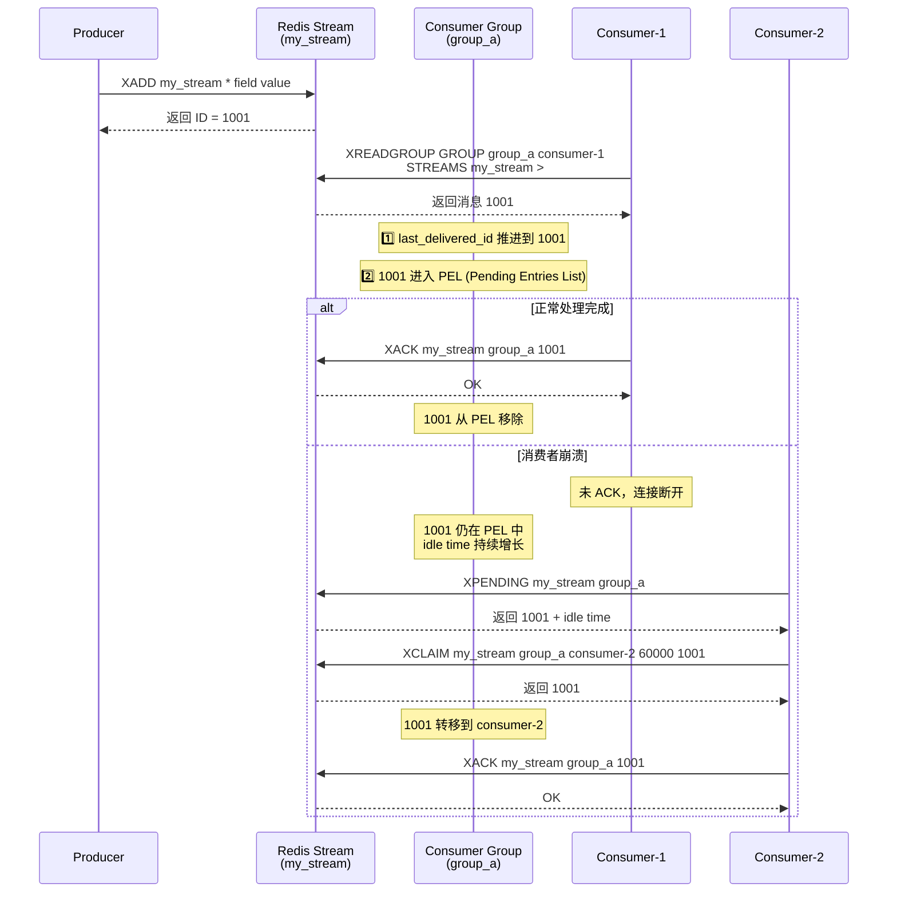

先说结论：**可以是可以，但不建议使用 Redis 来做消息队列。和专业的消息队列相比，还是有很多欠缺的地方。**

正式开始介绍之前，我们先来看看：**一个生产级 MQ 需要具备哪些核心能力？**

| 能力维度         | 定义                            | 关键指标/特征                       |
| :--------------- | :------------------------------ | :---------------------------------- |
| **持久化**       | 消息写入后不因进程/节点故障丢失 | 同步刷盘/多副本确认、RPO ≈ 0        |
| **至少一次投递** | 消息最终被消费，允许重复        | 需配合消费者幂等性                  |
| **消费确认**     | 消费者显式告知处理成功          | ACK 机制、超时重试、死信队列        |
| **消息重试**     | 消费失败可自动重新投递          | 退避策略、最大重试次数、死信转移    |
| **消费者组**     | 多消费者协作消费，故障自动转移  | 组内负载均衡、分区分配、Rebalance   |
| **消息堆积能力** | 生产速率 > 消费速率时的缓冲能力 | 磁盘存储、TTL、堆积告警             |
| **顺序保证**     | 消息按发送顺序被消费            | 分区有序/全局有序、乱序惩罚         |
| **可扩展性**     | 水平扩展以提升吞吐或容灾        | 分片机制、无状态 Broker、动态扩缩容 |

Redis 提供了多种实现 MQ 的方式，从早期的 `List` 到 `Pub/Sub`，再到 Redis 5.0 新增的 `Stream` 数据结构（基于有序链表实现，支持消费者组和 ACK 机制，可用于构建轻量级消息队列）。

### 第一阶段：早期用 List 数据结构

**Redis 2.0 之前，如果想要使用 Redis 来做消息队列的话，只能通过 List 来实现。**

通过 `RPUSH/LPOP` 或者 `LPUSH/RPOP` 即可实现简易版消息队列：

```bash
# 生产者生产消息
> RPUSH myList msg1 msg2
(integer) 2
> RPUSH myList msg3
(integer) 3
# 消费者消费消息
> LPOP myList
"msg1"
```

不过，通过 `RPUSH/LPOP` 或者 `LPUSH/RPOP` 这样的方式存在性能问题，我们需要不断轮询去调用 `RPOP` 或 `LPOP` 来消费消息。当 List 为空时，大部分的轮询的请求都是无效请求，这种方式大量浪费了系统资源。

因此，Redis 还提供了 `BLPOP`、`BRPOP` 这种阻塞式读取的命令（带 B-Blocking 的都是阻塞式），并且还支持一个超时参数。如果 List 为空，Redis 服务端不会立刻返回结果，它会等待 List 中有新数据后再返回或者是等待最多一个超时时间后返回空。如果将超时时间设置为 0 时，即可无限等待，直到弹出消息

```bash
# 超时时间为 10s
# 如果有数据立刻返回，否则最多等待10秒
> BRPOP myList 10
null
```

List 实现消息队列功能太简单，像消息确认机制等功能还需要我们自己实现。**最致命的是，它不支持一个消息被多个消费者消费（广播），而且消息一旦被取出，就没有了，如果消费者处理失败，消息就永久丢失了。**

### 第二阶段：引入 Pub/Sub（发布/订阅）模式

**Redis 2.0 引入了发布订阅 (Pub/Sub) 功能，解决了 List 实现消息队列没有广播机制的问题。**


Pub/Sub 中引入了一个概念叫 **Channel（频道）**，发布订阅机制的实现就是基于这个 Channel 来做的。

Pub/Sub 涉及发布者（Publisher）和订阅者（Subscriber，也叫消费者）两个角色：

- 发布者通过 `PUBLISH` 投递消息给指定 Channel。
- 订阅者通过`SUBSCRIBE`订阅它关心的 Channel。并且，订阅者可以订阅一个或者多个 Channel。

也就是说，多个消费者可以订阅同一个Channel，生产者向这个Channel发布消息，所有订阅者都能收到。

我们这里启动 3 个 Redis 客户端来简单演示一下：


Pub/Sub 既能单播又能广播，还支持 Channel 的简单正则匹配。

Pub/Sub有一个致命的缺陷：**它发后即忘，完全没有持久化和可靠性保证**。 如果消息发布时，某个消费者不在线，或者网络抖动了一下，那这条消息对它来说就永远丢失了。此外，它也**没有 ACK 机制**，无法知道消费者是否成功处理，更别提**消息堆积**的问题了。所以，Pub/Sub 只适合做一些对可靠性要求极低的实时通知，绝对不能用于任何严肃的业务消息队列。

### 第三阶段：Redis 5.0 新增 Stream

Redis 5.0 新增了 `Stream` 数据结构。这是一个基于 Radix Tree（基数树）实现的有序消息日志，天然支持消费者组和 ACK 机制，可用于构建轻量级消息队列。

**为什么要用 Radix Tree？** 很多人好奇，为什么不继续用 `List/LinkedList`？

    1. **内存极度压缩**：`Stream` 的消息 ID（如 `1625000000000-0`）是高度有序且前缀高度重合的。Radix Tree 是一种压缩前缀树，它会将具有相同前缀的节点合并。而 List/LinkedList
       每个元素都要完整的链表节点开销，并且无法利用 ID 的前缀重复特性来节省空间。
    2. **高效检索**：在处理数百万级消息堆积时，Radix Tree 能保持极高的查询效率，这也是 `Stream` 能支持大数据量范围查询（`XRANGE`）的底层底气。相比之下，`List/LinkedList`只能从头尾操作，无法高效按 ID 范围查询，执行 `XRANGE` 需要遍历整个列表。

它借鉴了 Kafka 等专业 MQ 的核心概念：

    1. **消费者组（Consumer Groups）**：实现消息在多个消费者间的负载均衡，支持故障自动转移。
    2. **持久化**：可以通过 RDB 和 AOF 保证消息在 Redis 重启后不丢失（取决于 `appendfsync` 配置，`everysec` 模式下通常最多丢失 1 秒数据）。
    3. **ACK 机制**：消费者处理完消息后，需要手动 `XACK` 确认，否则消息会保留在 `Pending List` 中。这保证了消息至少被成功消费一次。
    4. **消息回溯与转移**：支持 `XRANGE` 按时间范围回溯消息，以及 `XCLAIM` 将挂起的消息转移到其他消费者处理。

> 🌈 版本演进：
>
> - Redis 8.2：XACKDEL、XDELEX、XADD 和 XTRIM 命令提供了对流操作如何与多个消费者组交互的细粒度控制，简化了跨不同应用程序的消息处理协调。
> - Redis 8.6：支持幂等消息处理（最多一次生产），防止在使用至少一次交付模式时出现重复条目。此功能可实现可靠的消息提交，并自动去重。

`Stream` 的结构如下：


这是一个有序的消息链表，每个消息都有一个唯一的 ID 和对应的内容。ID 是一个时间戳和序列号的组合，用来保证消息的唯一性和递增性。内容是一个或多个键值对（类似 Hash 基本数据类型），用来存储消息的数据。

这里再对图中涉及到的一些概念，进行简单解释：

- `Consumer Group`：消费者组用于组织和管理多个消费者。消费者组本身不处理消息，而是再将消息分发给消费者，由消费者进行真正的消费。
- `last_delivered_id`：标识消费者组当前消费位置的游标，消费者组中任意一个消费者读取了消息都会使 last_delivered_id 往前移动。
- `pending_ids`：记录已经被客户端消费但没有 ack 的消息的 ID。

下面是`Stream` 用作消息队列时常用的命令：

- `XADD`：向流中添加新的消息。
- `XREAD`：从流中读取消息。
- `XREADGROUP`：从消费组中读取消息。
- `XRANGE`：根据消息 ID 范围读取流中的消息。
- `XREVRANGE`：与 `XRANGE` 类似，但以相反顺序返回结果。
- `XDEL`：从流中删除消息。
- `XTRIM`：修剪流的长度，可以指定修建策略（`MAXLEN`/`MINID`）。
- `XLEN`：获取流的长度。
- `XGROUP CREATE`：创建消费者组。
- `XGROUP DESTROY`：删除消费者组。
- `XGROUP DELCONSUMER`：从消费者组中删除一个消费者。
- `XGROUP SETID`：为消费者组设置新的最后递送消息 ID。
- `XACK`：确认消费组中的消息已被处理。
- `XPENDING`：查询消费组中挂起（未确认）的消息。
- `XCLAIM`：将挂起的消息从一个消费者转移到另一个消费者。
- `XINFO`：获取流（`XINFO STREAM`）、消费组（`XINFO GROUPS`）或消费者（`XINFO CONSUMERS`）的详细信息。

下面这张时序图展示了 Stream 消费者组消息流转与 ACK 机制：



总的来说，`Stream` 已经可以满足一个消息队列的基本要求了。不过，`Stream` 在实际使用中需要注意以下几点：

1. **持久化限制**：Redis 5.0 的 Stream 依赖 RDB/AOF 异步持久化，在故障恢复时可能丢失最近未持久化的消息（取决于 `appendfsync` 配置）。AOF 的 `everysec` 模式下通常最多丢失 1 秒数据。
2. **消息堆积受限**：Redis Stream 的数据存储在内存中，受服务器内存容量限制。相比 Kafka 基于磁盘的存储，Redis Stream 不适合海量堆积场景。
3. **消费组管理**：Consumer Group 的状态信息（如 `last_delivered_id`）需要定期维护，长时间未处理的 Pending 消息会占用内存。

下面这张表格是 Redis Stream 和常见 MQ 的对比：

| 维度           | Redis Stream               | RabbitMQ                         | Kafka                               | 内存队列                 |
| :------------- | :------------------------- | :------------------------------- | :---------------------------------- | :----------------------- |
| **吞吐量**     | 高（十万级 QPS）           | 中（万级 QPS）                   | **极高（百万级，靠分区水平扩展）**  | 极高（受限于 CPU/内存）  |
| **延迟**       | **极低（亚毫秒级）**       | **低（微秒/毫秒级，实时性强）**  | 中（毫秒级，受批处理影响）          | 极低（纳秒/微秒级）      |
| **持久化**     | 支持（RDB/AOF 异步）       | 支持（磁盘）                     | **强支持（原生磁盘顺序写）**        | 无                       |
| **消息堆积**   | 一般（受内存限制）         | 中（堆积多时性能下降明显）       | **极强（TB 级磁盘存储，性能稳定）** | 差（易 OOM）             |
| **消息回溯**   | 支持（按 ID/时间）         | **不支持（传统队列模式下）**     | **强支持（按 Offset/时间）**        | 不支持                   |
| **可靠性**     | 中（AOF 丢数据风险）       | **高（Confirm/确认机制成熟）**   | **极高（多副本 + 强一致性配置）**   | 低                       |
| **运维复杂度** | 低（运维 Redis 即可）      | 中（Erlang 环境，集群管理）      | 高（依赖 ZK 或 KRaft）              | 极低                     |
| **适用场景**   | 轻量级、低延迟、已有 Redis | **复杂路由、高可靠性、金融业务** | **大数据、日志聚合、高吞吐流处理**  | 进程内解耦、极致性能要求 |

### 总结

**回到最初的问题：Redis 到底能不能做MQ？**

- **如果业务简单、量小、追求极致性能**，且能容忍极小概率的数据丢失，使用 **Redis Stream** 是最优解，因为它省去了部署维护 MQ 的成本，可以复用现有的 Redis 组件（大部分需要用到 MQ 的项目，通常都会需要 Redis）。
- **如果是金融级业务、海量数据、需要严格保证不丢消息**，必须选择 **Kafka、RabbitMQ** 等更成熟的 MQ。

我的 [《SpringAI 智能面试平台+RAG 知识库》](https://javaguide.cn/zhuanlan/interview-guide.html)项目就是用的 Redis Stream 作为消息队列。在我的项目的场景下，它几乎是最合适的选择，完全够用了。


