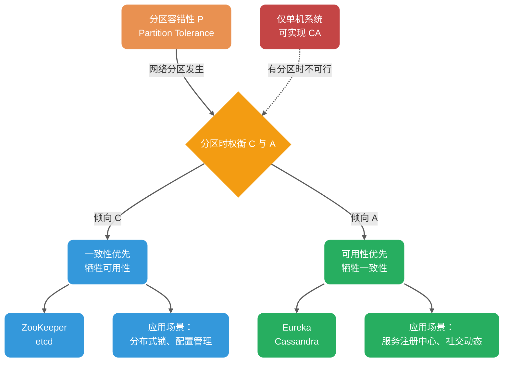
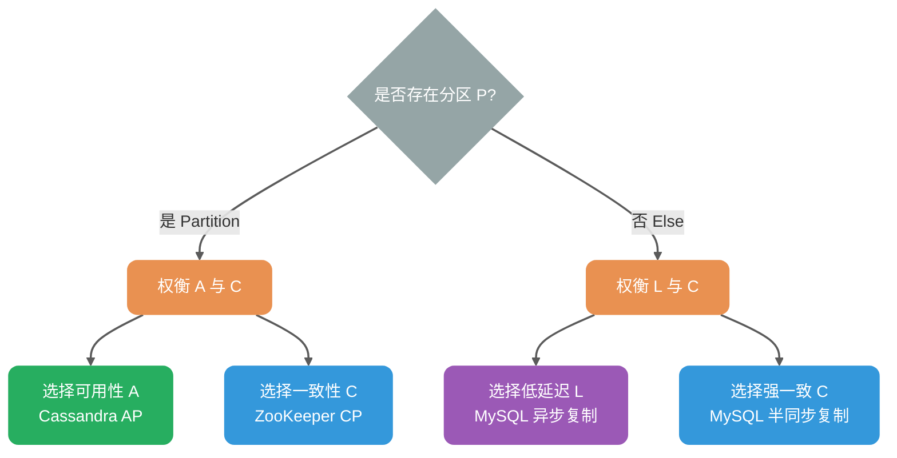
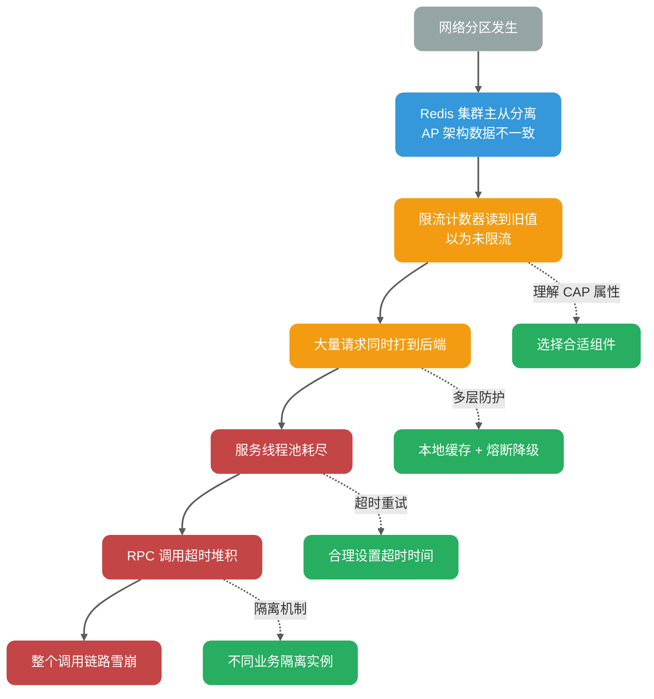
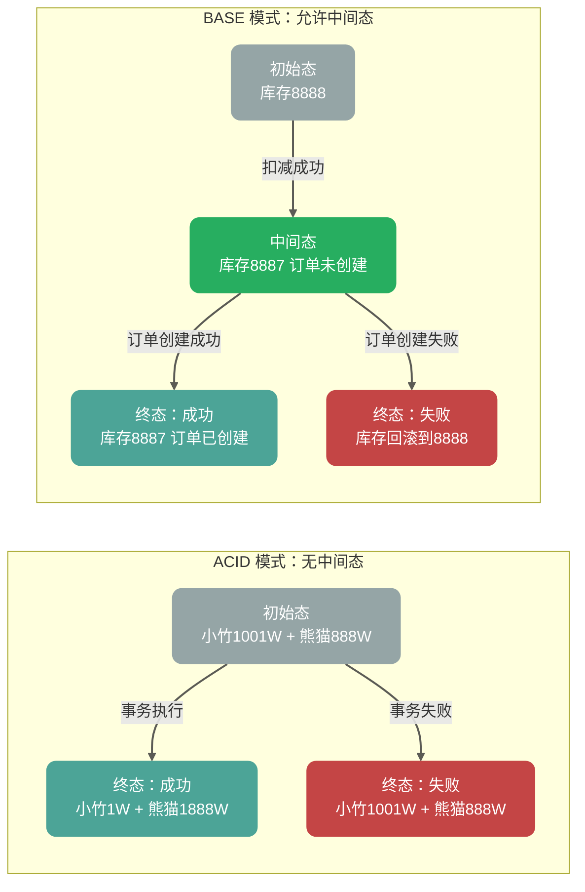
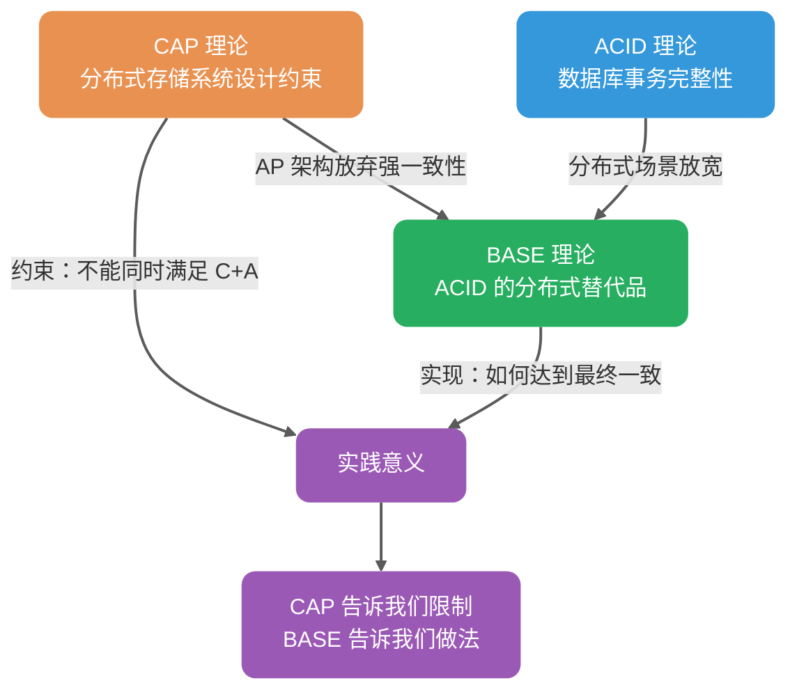

<!-- @include: @small-advertisement.snippet.md -->

经历过技术面试的小伙伴想必对 CAP & BASE 这两个理论再熟悉不过了！

我当年参加面试的时候，不夸张地说，只要问到分布式相关的内容，面试官几乎都会问到这两个基础理论。一是因为这是学习分布式知识的必备前置基础，二是因为很多面试官自己比较熟悉（方便提问）。

我们非常有必要将这两个理论搞懂，并且能够用自己的理解给别人讲出来。

## CAP 理论

[CAP 理论/定理](https://zh.wikipedia.org/wiki/CAP%E5%AE%9A%E7%90%86)起源于 2000 年，由加州大学伯克利分校的 Eric Brewer 教授在分布式计算原理研讨会（PODC）上提出，因此 CAP 定理又被称作 **布鲁尔定理（Brewer’s theorem）**

2 年后，麻省理工学院的 Seth Gilbert 和 Nancy Lynch 发表了布鲁尔猜想的证明，CAP 理论正式成为分布式领域的定理。

### 简介

CAP 定理讨论 Consistency（一致性）、Availability（可用性）和 Partition Tolerance（分区容错）。

> **重要说明**：下文使用「偏 CP / 偏 AP」仅作直觉描述。严格按 CAP 定义（C=Linearizability，A=每个非故障节点都必须响应）时，许多系统并不能被干净归类——同一系统内不同操作的一致性/可用性特征不同，很多系统既不满足 CAP-C 也不满足 CAP-A。


CAP 理论的提出者布鲁尔在提出 CAP 猜想的时候，并没有对 **Consistency**、**Availability**、**Partition Tolerance** 给出严格定义。

因此，对于 CAP 的民间解读有很多，比较常见、也更推荐的一种解读如下。

在理论计算机科学中，CAP 定理（CAP theorem）指出对于一个分布式系统来说，当设计读写操作时，只能同时满足以下三点中的两个：

- **一致性（Consistency）**：在 Gilbert/Lynch（2002）的证明语境里，CAP 的一致性 C 指的是 **Atomic Consistency**，通常等同于 **Linearizability（线性一致性）**。即所有操作按实时顺序线性化，即写操作一旦完成，后续所有读操作都必须返回该写入的值（或更新的值）。**注意：** 这里的 Consistency 与数据库 ACID 中的 Consistency（一致性约束）含义不同，后者指事务执行前后数据库状态满足完整性约束。
- **可用性（Availability）**：非故障的节点必须对每个请求返回响应（不讨论响应快慢）。**注意**：这是 CAP 理论中的严格定义，不包含工程中的延迟/SLA 指标（如「1s 内返回」）。
- **分区容错性（Partition Tolerance）**：CAP 里的 P 本质上是在假设异步网络（可能延迟/丢包/分区），不是一个你「选择要不要」的功能。真正的权衡是：当分区发生时，你必须在**线性一致（CAP 的 Consistency=Linearizability）**与**CAP-Availability（任何非故障节点都要对请求给非错误响应）**之间做选择。

**什么是网络分区？**

分布式系统中，多个节点之间的网络本来是连通的，但是因为某些故障（比如部分节点网络出了问题）某些节点之间不连通了，整个网络就分成了几块区域，这就叫 **网络分区**。


### 不是所谓的「3 选 2」

大部分人解释这一定律时，常常简单地表述为：「一致性、可用性、分区容忍性三者你只能同时达到其中两个，不可能同时达到」。实际上这是很有误导性的说法，而且在 CAP 理论诞生 12 年之后，CAP 之父也在 2012 年重写了之前的论文。

> **当发生网络分区的时候，如果我们要继续服务，那么强一致性和可用性只能 2 选 1。**
>
> 简而言之：CAP 理论中分区容错性 P 不是一定要满足的，但当选择满足 P 时，在此基础上只能满足可用性 A 或者一致性 C。

**为啥不可能选择 CA 架构呢？**

因为分布式系统离不开网络通信，而网络故障是常态：

- 心跳检测可能因网络抖动丢包，导致误判节点故障
- 数据同步过程中可能因包丢失导致不一致，系统为达成一致会不断重试，造成请求阻塞

**因此，在异步网络模型下（分区可能发生），当分区发生时，必须在线性一致性与 CAP-可用性之间取舍。** 能够保证 CA 的只有单机系统——因为只有一个节点，数据写入成功后所有请求都能看到相同数据；只要这个节点活着，系统就可用。

下面这张图展示了 CAP 理论的核心权衡和常见系统的倾向：



这里需要引入 **PACELC 理论**（CAP 的扩展）来更全面地解释：

Daniel J. Abadi 提出的 PACELC 理论指出：**如果存在分区（P），必须在可用性（A）和一致性（C）之间选择；否则（E，Else），必须在延迟（L）和一致性（C）之间选择。**



实际意义：即使无网络分区，分布式系统仍需在低延迟（异步复制）和强一致（同步复制）之间权衡。例如：

- **Cassandra**：可通过调整读写一致性级别（ONE/QUORUM/ALL）在延迟与一致性间权衡
- **MySQL 主从**：可选择异步复制（低延迟）或半同步复制（强一致）

比如 ZooKeeper、HBase 就是 CP 架构，Cassandra、Eureka 就是 AP 架构，Nacos 不仅支持 CP 架构也支持 AP 架构。

**选择 CP 还是 AP 的关键在于当前的业务场景，没有定论**：比如对于需要确保强一致性的场景如分布式锁、配置管理会选择 CP；对于高可用优先的场景如微服务注册中心会选择 AP。

**另外，需要补充说明的一点**：在无分区时，可以同时做到线性一致与「会响应」的 CAP-可用性；但工程上通常还要在延迟与一致性之间权衡（这便是 PACELC 理论中 ELC 部分讨论的内容）。

### CAP 理论的适用范围

**重要结论**：CAP 理论主要讨论单个数据对象在副本复制场景下的一致性与可用性权衡。

| 更贴近 CAP 讨论模型 | 需要拆分到分片/对象/操作级别分析     |
| ------------------- | ------------------------------------ |
| Redis 主从/哨兵集群 | 业务系统（无状态服务）\*             |
| MySQL 主从/多主集群 | Redis-Cluster（每个 shard 仍有副本） |
| MongoDB 副本集      | MongoDB-Cluster（分片 + 副本并存）   |
| ZooKeeper、etcd     | 分库分表（跨分片事务需额外协调）     |
| Kafka、RocketMQ     | 大多数微服务应用\*                   |

**说明**：

- **CAP 讨论模型**：单个读写寄存器（single register）的副本复制语义
- **复杂系统**：需要拆解到「每个对象/分区/操作」的一致性语义讨论
- **分片 + 副本**：分片系统每个 shard 通常仍有副本复制，一致性与可用性权衡仍在

> **业务系统与 CAP 的深度关联**：
>
> 业务系统本身虽不涉及副本同步，但**深受底层组件 CAP 属性的影响**。忽视这一点会导致系统在遭遇网络分区时发生级联雪崩（Cascading Failure）。
>
> **受 CAP 属性影响的业务场景**：
>
> | 业务场景 | 底层组件                     | CP 组件的影响              | AP 组件的影响                  |
> | -------- | ---------------------------- | -------------------------- | ------------------------------ |
> | RPC 路由 | 注册中心（如 Nacos CP 模式） | 注册期间不可用，请求被拒绝 | 可能路由到已下线实例，需要重试 |
> | 分布式锁 | Redis（AP）/ ZooKeeper（CP） | 性能较低但可靠             | 性能高但可能锁失效             |
> | 限流熔断 | Redis 计数器                 | 可能读到旧计数，限流失效   | 同左                           |
> | 缓存更新 | Redis 主从                   | 主从切换时可能丢数据       | 同左                           |
> | 消息消费 | Kafka                        | 消费进度同步慢，重复消费   | 同左                           |
>
> **实践建议**：业务开发者虽然不需要「实践」CAP 理论，但**必须理解 CAP 理论**，以便：
>
> - 为不同业务场景选择合适的组件（CP 或 AP）
> - 理解所选组件在网络分区时的行为特征
> - 设计符合业务需求的容错机制（重试、熔断、降级）

很多开发者认为自己在「实践 CAP 理论」，实际上只是站在已有组件上做选择（用 CP 还是 AP），而非真正实践该理论。真正需要实践 CAP 的是研发 Redis、MySQL 这类分布式存储组件的工程师。

### 在业务中应用 CAP 思想

除研发分布式存储组件外，业务开发中更多是**选择**合适的架构，而非实践 CAP 理论本身：

| 场景           | 偏向 CP 的选择               | 偏向 AP 的选择           | 业务权衡                 |
| -------------- | ---------------------------- | ------------------------ | ------------------------ |
| 数据库主从复制 | 同步复制（强一致）           | 异步复制（高性能）       | 数据一致性 vs 响应速度   |
| 分布式锁实现   | ZooKeeper（强一致）          | Redis（高性能）          | 锁的可靠性 vs 获取速度   |
| 服务注册中心   | ZooKeeper、Consul（CP 模式） | Eureka、Nacos（AP 模式） | 注册准确性 vs 发现可用性 |
| 限流计数器     | Redis（强一致命令）          | Redis（允许过期）        | 限流精度 vs 性能         |

**选型原则**：

- **关注性能**：倾向选择允许异步复制的组件，写入主节点即可返回成功，响应快；但存在数据丢失/读取到旧数据的风险，需配合重试机制
- **关注数据安全**：倾向选择要求多数派确认的组件，写入需等待 quorum 节点确认，响应慢；但能降低数据丢失风险

**注意**：数据丢失与否更取决于持久化、复制确认策略、故障模型，不能简单地用「CP/AP 标签」来判断。

**级联雪崩案例**：

一个典型的忽视 CAP 导致的级联雪崩场景：



**防护措施**：

1. **理解底层组件的 CAP 属性**：知道在网络分区时组件的行为
2. **多层防护**：不只依赖单一组件，结合本地缓存、熔断、降级
3. **超时与重试**：合理设置超时时间，避免无限等待
4. **隔离机制**：不同业务使用不同的底层组件实例，避免故障扩散

### CAP 实际应用案例

我这里以注册中心来探讨一下 CAP 的实际应用。考虑到很多小伙伴不知道注册中心是干嘛的，这里简单以 Dubbo 为例说一说。

下图是 Dubbo 的架构图。**注册中心 Registry 在其中扮演什么角色呢？提供了什么服务呢？**

注册中心负责服务地址的注册与查找，相当于目录服务，服务提供者和消费者只在启动时与注册中心交互，注册中心不转发请求，压力较小。


常见的可以作为注册中心的组件有：ZooKeeper、Eureka、Nacos...。

#### ZooKeeper 3.8.x（CP 架构）

ZooKeeper 倾向 **CP 架构**。ZooKeeper 3.x 通过 ZAB 协议提供 **Linearizable Writes（线性化写入）**，但读取行为需区分：

- **Sync 读取**：强制与 Leader 同步，保证线性一致性（Linearizability）。
- **普通读取**：默认提供 **顺序一致性（Sequential Consistency）**，保证全局更新操作的顺序，同一会话内客户端视图绝不会发生回退，但可能读到稍旧数据（存在读取滞后）。

> **重要区别**：顺序一致性 ≠ 最终一致性。ZooKeeper 的普通读取保证所有客户端看到相同的**更新顺序**（全局 zxid 顺序），只是存在读取滞后；而最终一致性不保证全局顺序，仅保证最终收敛。ZK 的默认读更像是「stale-but-ordered」的读（顺序/会话保证很强），而不是 Dynamo 系那种 eventual consistency 语境。

在 Leader 选举期间或 Follower 节点数不足 Quorum（N/2+1）时，ZooKeeper 会拒绝服务以维持一致性，表现为不可用（牺牲 A）。

在多节点部署下，集群采用 Quorum 模式：多数派节点（n/2+1）必须同意变更才有效。

ZooKeeper 提供 Watcher 机制（异步通知变更）和版本号机制（zxid 校验新鲜度）以缓解读取滞后问题。

失败路径与状态机表现：

| 故障场景                        | 系统状态                        | 客户端表现                                                   |
| ------------------------------- | ------------------------------- | ------------------------------------------------------------ |
| Quorum 失效（半数以上节点故障） | **LOOKING** 状态，Leader 选举中 | 写入请求拒绝，读取请求可能返回旧数据或超时                   |
| Follower 与 Leader 分区         | Follower 进入 **ELECTION** 状态 | 该 Follower 无法参与投票，但可响应读取（滞后数据）           |
| Leader 与多数派分区             | Leader 自动降级，集群重新选举   | 原Leader的写入丢失，需客户端重试（检测到 zxid 回退）         |
| Watcher 丢失                    | 网络抖动或 GC 压力导致          | 客户端需重试（指数退避 + Jitter），监控 `Watches` 队列防背压 |

#### Eureka（AP 架构）

Eureka 采用 AP 架构：节点对等，通过 Peer 复制/同步（定期全量拉取 + 增量更新）保持数据一致，无 Leader 选举。**注意**：Spring Cloud 生态中历史上更常见 1.x 依赖形态；Netflix/eureka 的 2.x 仍在维护并持续发布。

失败路径与状态机表现：

| 故障场景                     | 系统状态                                 | 客户端表现                                                                                      | 自我保护机制                                                          |
| ---------------------------- | ---------------------------------------- | ----------------------------------------------------------------------------------------------- | --------------------------------------------------------------------- |
| 网络分区（脑裂）             | 分区两侧**独立运行**，均可读写           | 客户端可能读到旧注册信息（不一致窗口 = 心跳间隔 30s + gossip 传播延迟，10 节点拓扑中 P99 <60s） | 当续约阈值 < 85% 时触发**自我保护**，暂停实例剔除，避免"误杀"健康实例 |
| 半数节点故障                 | 剩余节点继续服务，但数据可能分叉         | 读操作正常，写入可能仅存于少数派节点                                                            | 自我保护触发，待节点恢复后通过 gossip 自动合并                        |
| 节点短暂重启                 | 从 Peer 批量拉取注册表（Registry Fetch） | 服务发现短暂不可用（< 1min），缓存起作用                                                        | 正常模式，自动恢复                                                    |
| 注册风暴（大量实例同时注册） | 写队列堆积，可能导致请求丢弃             | 部分注册请求超时，需客户端重试                                                                  | 可配置限流与背压（如 Ribbon 重试策略）                                |

**自我保护机制详细说明**：

Eureka Server 通过以下逻辑判断是否进入自我保护：

```
每分钟期望续约数 E = 当前实例数 N × (60 / 心跳间隔秒数)
阈值 T = E × 0.85
若最近 1 分钟实际续约数 R < T，则进入自我保护：暂停剔除（eviction）
（E/T 会按固定周期根据 N 更新，常见周期约 15 分钟）
```

默认心跳间隔为 30 秒时，每分钟期望续约数 = 实例数 × 2。

当 `实际续约率 < 85%` 时：

1. 进入 **SELF PRESERVATION** 模式
2. 停止剔除过期实例（EvictionTask 暂停）
3. 日志输出：`ENTER SELF PRESERVATION MODE`

**设计权衡**：宁可保留「僵尸」实例，也不误杀健康实例——因为在微服务场景下，短暂的服务降级好过大规模服务不可用。客户端通常配置重试与熔断来处理不可用实例。

#### 总结

选择 CP 或 AP 取决于场景：ZooKeeper 适合强一致需求，如配置管理；Eureka 适合高可用注册，如微服务发现。

Nacos 不仅支持 CP 也支持 AP。

### 总结

CAP 理论指导我们：在分布式系统可能出现网络分区（P）的前提下，我们必须在强一致性（C）和高可用性（A）之间做出权衡。

- **CP 架构**：牺牲可用性，保证强一致性。适用于对数据一致性要求极高的场景（如金融交易、分布式锁）。
- **AP 架构**：牺牲一致性，保证高可用性。适用于对系统可用性要求较高，能容忍短暂数据不一致的场景（如社交动态、商品搜索）。
- **PACELC**：在无分区（E）时，需在延迟（L）和一致性（C）之间权衡。

### 推荐阅读

1. [CAP 定理简化](https://medium.com/@ravindraprasad/cap-theorem-simplified-28499a67eab4) （英文，有趣的案例）
2. [神一样的 CAP 理论被应用在何方](https://juejin.im/post/6844903936718012430) （中文，列举了很多实际的例子）
3. [请停止呼叫数据库 CP 或 AP](https://martin.kleppmann.com/2015/05/11/please-stop-calling-databases-cp-or-ap.html) （英文，带给你不一样的思考）

## BASE 理论

[BASE 理论](https://dl.acm.org/doi/10.1145/1394127.1394128)起源于 2008 年，由 eBay 的架构师 Dan Pritchett 在 ACM 上发表，论文标题为《Base: An ACID Alternative》。

> **关键洞察**：从论文标题可以看出，**BASE 首先是 ACID 的替代品**。但同时需要注意，BASE 与 CAP 理论也存在密切关系——**最终一致性正是 CAP 中 AP 架构在工程实践中达到系统收敛的指导原则**。

### 简介

**BASE** 是 **Basically Available（基本可用）**、**Soft-state（软状态）** 和 **Eventually Consistent（最终一致性）** 三个短语的缩写。BASE 理论来源于对大规模互联网系统分布式实践的总结。

### BASE 与 ACID 的关系

要理解 BASE 理论，首先需要回顾 ACID 理论中的 **一致性（Consistency）**：

**ACID 的一致性定义**：事务执行前后，数据库只能从一个一致状态转变为另一个一致状态。

以转账为例：小竹向熊猫转账 1000W。

- **初始态**：小竹 1001W，熊猫 888W，合计 1889W
- **结果态**：小竹 1W，熊猫 1888W，合计 1889W

无论事务成功或失败，整体数据的变化必须一致——类似于能量守恒定律。

**分布式场景的挑战**：

在分布式系统中，商品服务和订单服务分离部署，[扣减库存、创建订单]需要通过网络调用，这中间必然存在时间差：

```
时刻 T1：库存 8888 → 8887（扣减成功）
时刻 T2：网络调用订单服务...
时刻 T3：订单创建成功
```

在 T1~T3 期间，系统处于 **中间态**：库存已减，订单未创建。跨服务后无法用单库 ACID 事务保证整体原子提交与隔离，系统会客观存在中间态；BASE 接受中间态并通过补偿/重试让状态最终收敛。

**BASE 理论的解决方案**：

BASE 理论承认并允许这种中间态的存在：

- **Soft-state（软状态）**：允许系统存在中间态，且该中间态不影响系统整体可用性
- **Eventually consistent（最终一致性）**：中间态最终会演变成终态（要么成功，要么回滚）

下面通过一个对比图来直观理解 ACID 和 BASE 在事务处理上的不同模式：



因此，**BASE 理论是 ACID 在分布式场景中的替代品**，而非 CAP 理论的补充。

### BASE 理论三要素


#### 基本可用

基本可用是指分布式系统在出现不可预知故障的时候，允许损失部分可用性。但是，这绝不等价于系统不可用。

**什么叫允许损失部分可用性呢？**

- **响应时间上的损失**：正常情况下，处理用户请求需要 0.5s 返回结果，但是由于系统出现故障，处理用户请求的时间变为 3s。
- **系统功能上的损失**：正常情况下，用户可以使用系统的全部功能，但是由于系统访问量突然剧增，系统的部分非核心功能无法使用。

#### 软状态

软状态（Soft State）是指允许系统中的数据存在中间状态，并认为该中间状态的存在不会影响系统的整体可用性。

> **与 ACID 的区别**：ACID 理论要求事务执行后立即进入终态（成功或失败），不允许中间态；而 BASE 理论承认中间态是分布式系统的客观存在，只要中间态最终会演变成终态即可。

举例说明：

- **ACID 模式**：银行转账事务中，扣款和入账必须同时成功或同时失败，不允许「扣款成功但入账未完成」的中间态
- **BASE 模式**：电商下单事务中，允许「库存已减但订单未创建」的中间态存在，只要最终会达到一致（要么订单创建成功，要么库存回滚）

#### 最终一致性

最终一致性（Eventual Consistency）强调：**若系统在一段时间内无新的更新操作，则所有副本最终收敛到相同值。**

需要注意的是，「最终一致性」这个词在两个不同语境下有不同含义：

| 语境                           | 含义                     | 典型场景                   |
| ------------------------------ | ------------------------ | -------------------------- |
| **副本式存储（CAP 语境）**     | 数据副本最终同步一致     | Cassandra 数据复制         |
| **事务状态（BASE/ACID 语境）** | 事务中间态最终演变成终态 | 分布式事务（如 TCC、Saga） |

**副本式存储的最终一致性**：

「一段时间」是未界定的——可能是毫秒级（局域网同步）或分钟级（跨地域复制）。生产环境中需通过 **Read Repair（读修复）**、**Anti-Entropy（反熵/后台同步）** 或 **Quorum 写入** 主动加速收敛。

**事务状态的最终一致性**：

以分布式事务为例：[扣减库存、创建订单、扣减余额]

- 时刻 T1：库存已减（中间态）
- 时刻 T2：订单已创建（中间态）
- 时刻 T3：余额已扣（终态：事务成功）

或在失败场景：

- 时刻 T1：库存已减（中间态）
- 时刻 T2：订单创建失败（触发回滚）
- 时刻 T3：库存回滚（终态：事务失败）

系统会保证在一定时间内达到数据一致的状态，而不需要实时保证系统数据的强一致性。

分布式一致性的 3 种级别：

1. **强一致性**：系统写入了什么，读出来的就是什么。
2. **弱一致性**：不一定可以读取到最新写入的值，也不保证多少时间之后读取到的数据是最新的，只是会尽量保证某个时刻达到数据一致的状态。
3. **最终一致性**：弱一致性的升级版，系统会保证在一定时间内达到数据一致的状态。

**业界比较推崇最终一致性级别，但是某些对数据一致要求十分严格的场景比如银行转账还是要保证强一致性。**

那实现最终一致性的具体方式是什么呢？

- **读时修复（Read Repair）**：在读取数据时，检测数据的不一致，进行修复。适合读多写少场景。
- **写时修复（Hinted Handoff）**：在写入数据时，如果目标节点不可用，将数据缓存下来，待节点恢复后重传。**写时修复** 优化了写入延迟，但增加了读取时的不一致风险（数据可能还在缓存队列中未落盘到目标节点）。
- **异步修复（Anti-Entropy/反熵）**：通过后台比对副本数据差异并修复。工程实现中关键挑战是**高效检测数据差异**——暴力逐条比对（O(n)）在大规模数据集下不可行，生产系统采用**默克尔树（Merkle Tree）**实现低开销差异定位：

**选择建议**：

- **写时修复**：适合写多读少，优化写入性能，但牺牲一致性窗口。
- **读时修复**：适合读多写少，保证读取数据的准确性。
- **Anti-Entropy**：后台兜底保障，适合数据规模大但对最终一致性要求高的场景。

### 为什么很多人把 BASE 当作 CAP 的补充？

这是一个**部分正确但表述不够精确**的说法。更准确的理解是：

1. **BASE 首先是 ACID 的替代品**：从论文标题[《Base: An ACID Alternative》](https://spawn-queue.acm.org/doi/10.1145/1394127.1394128)可以看出，BASE 理论的初衷是解决分布式事务场景下 ACID 过于严格的问题。

2. **BASE 与 CAP 的 AP 架构存在内在联系**：

   - 选择 AP 架构意味着放弃强一致性（C）
   - 放弃强一致性后，系统如何达到收敛？答案是**最终一致性**
   - 因此，BASE 理论（特别是最终一致性）是 AP 架构在工程实践中**必须采用**的指导原则

3. **误解产生的根源**：很多人把"BASE 与 AP 相关"误解为"BASE 是 CAP 的补充"。实际上：
   - **BASE 不是对 CAP 理论的补充或修正**
   - **BASE 是 AP 架构选择的工程实践指南**——当你选择了 AP，BASE 告诉你如何在工程实践中让系统最终达到一致

**正确的理解**：



| 维度       | CAP 理论                 | BASE 理论                                        |
| ---------- | ------------------------ | ------------------------------------------------ |
| 关注领域   | 分布式存储系统（带副本） | 所有分布式系统                                   |
| 一致性含义 | 数据一致性（副本同步）   | 状态一致性（事务终态）                           |
| 可用性含义 | 节点故障时系统可用       | 部分节点故障时部分功能可用                       |
| 核心关系   | -                        | ① ACID 的分布式替代品<br>② AP 架构的工程实践指南 |

> **实践意义**：CAP 告诉我们在 AP 架构下无法保证强一致性，BASE 告诉我们在 AP 架构下如何通过最终一致性让系统达到收敛——两者是**约束与实现**的关系，而非补充关系。

如果说 CAP 是分布式存储系统的设计约束（告诉我们不能做什么），那么 BASE 就是分布式系统（尤其是业务系统）的实践指导（告诉我们如何做）——它告诉我们：**绝大多数应用场景不需要强一致性，通过接受中间态并最终达到一致性，是更务实的选择。**

### 总结

**ACID 是数据库事务完整性的理论，CAP 是分布式存储系统的设计理论，BASE 是 ACID 在分布式场景中的替代品，同时也是 AP 架构的工程实践指南。**

> **关键对应关系**：
>
> - **CAP 的一致性** = 数据一致性（副本节点间的数据同步）
> - **BASE 的一致性** = 状态一致性（事务终态的一致）= ACID 的一致性
> - **CAP 的可用性** = 主从集群的可用性（节点故障时系统仍可用）
> - **BASE 的可用性** = 分片式集群的可用性（部分节点故障只影响部分用户）
> - **CAP 与 BASE 的关系**：选择 AP 架构后，BASE 理论指导如何在工程实践中通过最终一致性达到系统收敛

## 生产落地建议

### 选择 CP 还是 AP 的决策框架

> **重要提示**：简单给系统贴「CP/AP」标签是有风险的。在网络分区下：
>
> - **X 的写更倾向于优先保持线性一致**（可能拒绝服务/降级）
> - **Y 更倾向于优先保持可用**（允许短时间读到旧数据）
>   具体取决于操作类型与配置。

| 场景特征                       | 倾向选择       | 典型系统说明                                                |
| ------------------------------ | -------------- | ----------------------------------------------------------- |
| 强一致性要求（金融转账）       | 倾向线性一致写 | ZooKeeper（写入需 Quorum 确认）、etcd、Consul（CP 模式）    |
| 高可用优先（服务发现）         | 倾向可用性     | Eureka（允许读到旧实例）、Consul（可切换模式）              |
| 可调一致性（根据业务动态选择） | 可配置         | Nacos（支持 CP/AP 切换）、Cassandra（可调节读写一致性级别） |
| 写多读少                       | 倾向异步写优化 | Cassandra（可配置 QUORUM 写）、HBase                        |
| 读多写少                       | 倾向低延迟读   | DynamoDB（可调节最终一致性级别）                            |

### 监控指标

- **分区检测时间**：多久发现网络分区
- **收敛时间（Convergence Time）**：副本从不一致到一致的时间
- **读写延迟 P99**：CAP 权衡的直接体现
- **不一致窗口**：业务可接受的数据延迟

### 常见误区

#### CAP 相关误区

- ❌ 「选择了 AP 就永远放弃一致性」→ ✅ AP 系统可通过 Read Repair、Anti-Entropy（Merkle Tree）达到最终一致
- ❌ 「ZooKeeper 是强一致的」→ ✅ ZooKeeper 提供**线性化写入** + **顺序一致性读取**（非最终一致性），读取存在滞后但保证全局顺序
- ❌ 「顺序一致性 = 最终一致性」→ ✅ 顺序一致性保证全局更新顺序，最终一致性不保证顺序；ZooKeeper 普通读取是前者而非后者
- ❌ 「银行系统必须 CP」→ ✅ 实际银行采用 BASE + 补偿事务（Saga），核心账务强一致，查询服务可最终一致
- ❌ 「业务系统不需要考虑 CAP」→ ✅ 业务系统虽不直接实践 CAP，但 RPC 路由、限流熔断、分布式锁等均受底层组件 CAP 属性影响，忽视会导致级联雪崩
- ❌ 「分库分表不需要考虑 CAP」→ ✅ 分片式存储通常仍然需要为每个 shard 做副本复制，因此仍需面对 CAP 的权衡
- ❌ 「CAP 的 A 等于低延迟/高 SLA」→ ✅ CAP 的可用性定义不包含延迟要求，只要求非故障节点必须返回响应（可以很慢）

#### BASE 相关误区

- ❌ 「BASE 是 CAP 的补充/延伸」→ ✅ BASE 首先是 ACID 的替代品；同时 BASE 是 AP 架构的工程实践指南（AP 选择了放弃强一致性，BASE 告诉你如何达到最终一致）
- ❌ 「BASE 的一致性 = CAP 的一致性」→ ✅ BASE 的一致性是状态一致性（= ACID 一致性），CAP 的一致性是数据一致性
- ❌ 「BASE 只适用于主从集群」→ ✅ BASE 适用于所有分布式系统；其「基本可用」概念在分片式集群中表现更明显（部分节点故障只影响部分用户）
- ❌ 「最终一致性是弱一致性」→ ✅ 最终一致性是弱一致性的升级版，保证系统最终会达到一致状态，而弱一致性不提供此保证

<!-- @include: @article-footer.snippet.md -->
