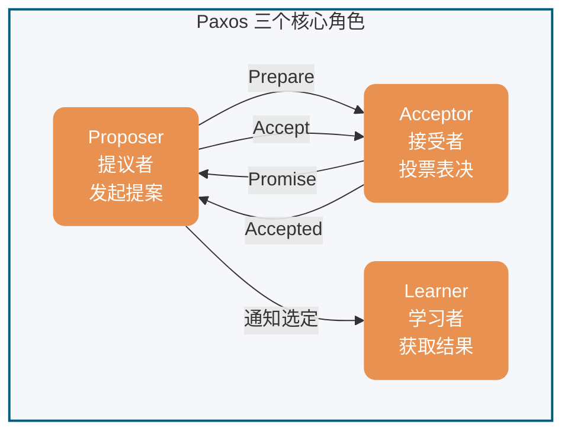
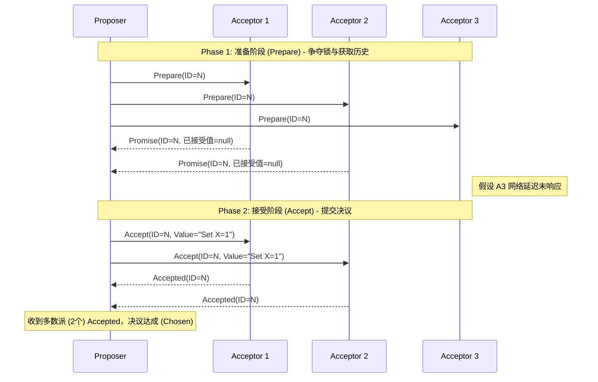
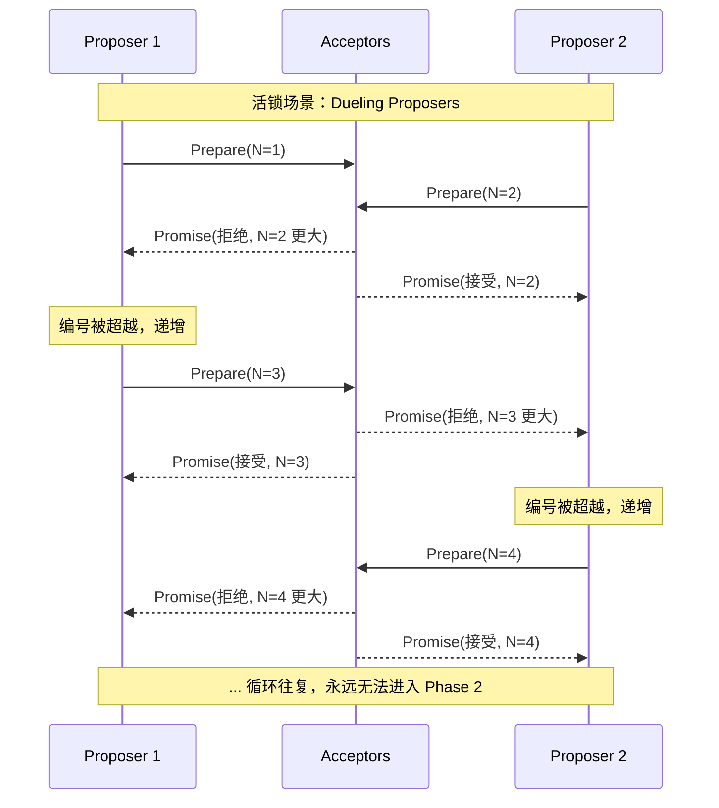
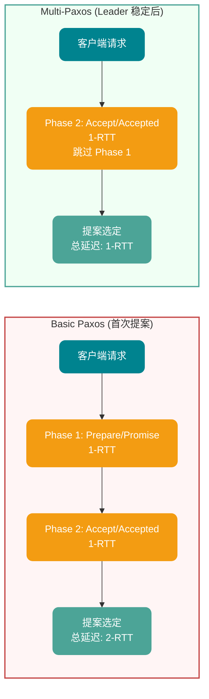
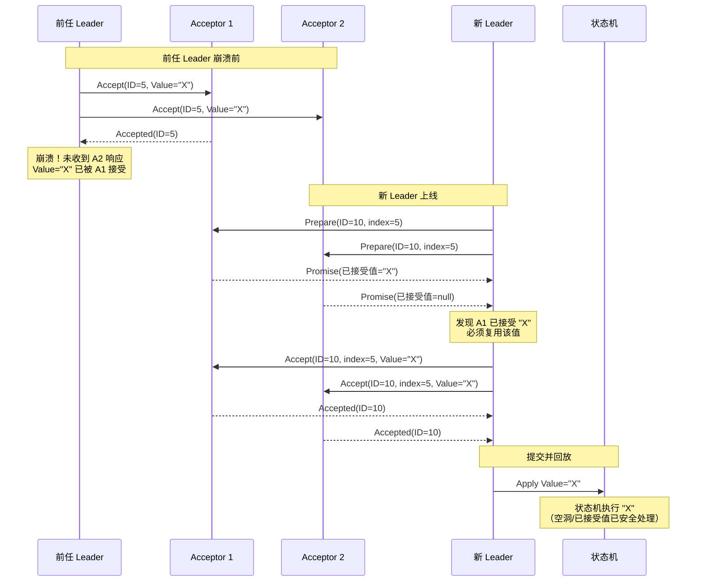
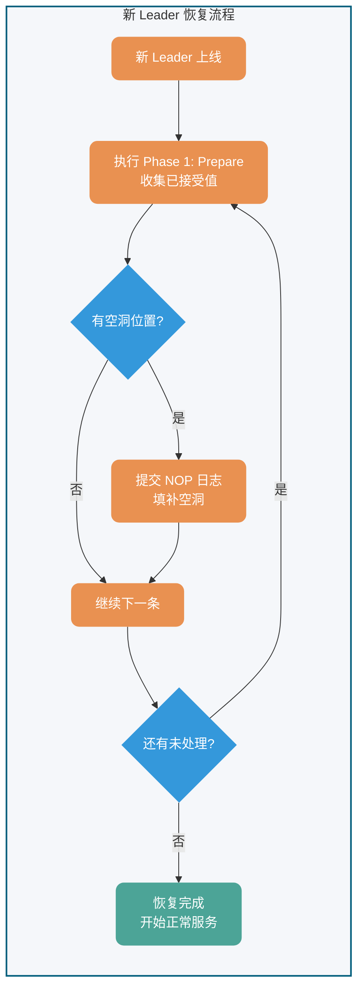

## 背景

Paxos 算法是 Leslie Lamport（莱斯利·兰伯特）在 **1990** 年提出的一种分布式系统 **共识** 算法。这是最早被广泛认可的分布式共识算法之一（前提是不存在拜占庭将军问题，也就是没有恶意节点）。

为了介绍 Paxos 算法，兰伯特专门写了一篇幽默风趣的论文。在这篇论文中，他虚拟了一个叫做 Paxos 的希腊城邦来更形象化地介绍 Paxos 算法。

不过，审稿人并不认可这篇论文的幽默。于是，他们就给兰伯特说："如果你想要成功发表这篇论文的话，必须删除所有 Paxos 相关的故事背景"。兰伯特一听就不开心了："我凭什么修改啊，你们这些审稿人就是缺乏幽默细胞，发不了就不发了呗！"。

于是乎，提出 Paxos 算法的那篇论文在当时并没有被成功发表。

直到 1998 年，系统研究中心 (Systems Research Center，SRC）的两个技术研究员需要找一些合适的分布式算法来服务他们正在构建的分布式系统，Paxos 算法刚好可以解决他们的部分需求。因此，兰伯特就把论文发给了他们。在看了论文之后，这俩大佬觉得论文还是挺不错的。于是，兰伯特在 **1998** 年重新发表论文 [《The Part-Time Parliament》](http://lamport.azurewebsites.net/pubs/lamport-paxos.pdf)。

论文发表之后，各路学者直呼看不懂，言语中还略显调侃之意。这谁忍得了，在 **2001** 年的时候，兰伯特专门又写了一篇 [《Paxos Made Simple》](http://lamport.azurewebsites.net/pubs/paxos-simple.pdf) 的论文来简化对 Paxos 的介绍，主要讲述两阶段共识协议部分，顺便还不忘嘲讽一下这群学者。

《Paxos Made Simple》这篇论文就 14 页，相比于 《The Part-Time Parliament》的 33 页精简了不少。最关键的是这篇论文的摘要就一句话：


> The Paxos algorithm, when presented in plain English, is very simple.

翻译过来的意思大概就是：当我用无修饰的英文来描述时，Paxos 算法真心简单！

有没有感觉到来自兰伯特大佬满满地嘲讽的味道？

## 介绍

本文将 Paxos 分为两部分进行讲解：

- **Basic Paxos 算法**：描述多节点之间如何就单个值（value）达成共识。
- **Multi-Paxos 思想**：通过执行多个 Basic Paxos 实例，就一系列值达成共识。

共识算法的作用是让分布式系统中的多个节点对某个提案（proposal）达成一致。"提案"在不同系统里可指代的对象很广，如选主、事件排序等都可以是提案。

由于 Paxos 算法公认难以理解和实现，2013 年诞生了更易理解的 [Raft 算法](https://javaguide.cn/distributed-system/theorem&algorithm&protocol/raft-algorithm.html)。

**关于 Raft 与 Paxos 的关系**：从学术角度，Raft 并非 Paxos 的严格变体——两者在底层设计哲学（如日志空洞、Leader 权限）上存在本质差异。但从工程实践角度，Raft 的设计灵感源于 Multi-Paxos，可理解为"受 Multi-Paxos 启发的重新设计"。本文后文将详细对比二者区别。

针对非拜占庭场景（无恶意节点），除 Raft 外，**ZAB 协议**、**Fast Paxos** 等都是基于 Paxos 改进的共识算法。

针对拜占庭场景（存在恶意节点），通常使用 **工作量证明（PoW，Proof-of-Work）**、**权益证明（PoS，Proof-of-Stake）** 等共识算法，典型应用为区块链系统。

## Basic Paxos 算法

### 角色定义

Basic Paxos 中存在 3 个重要的角色：

1. **提议者（Proposer）**：也可以叫做协调者（coordinator），负责接受客户端请求并发起提案。提案信息通常包括提案编号（proposal ID）和提议的值（value）。
2. **接受者（Acceptor）**：也可以叫做投票员（voter），负责对提案进行投票，同时需要记住自己的投票历史。
3. **学习者（Learner）**：负责学习（learn）已被选定的值。在复制状态机（RSM）实现中，该值通常对应一条待执行的命令，由状态机按序 apply 后再由对外服务层返回结果。


**角色交互关系图**：



为了减少实现该算法所需的节点数，一个节点可以身兼多个角色。并且，一个提案被选定需要被半数以上的 Acceptor 接受。这样的话，Basic Paxos 算法还具备容错性，在少于一半的节点出现故障时，集群仍能正常工作。

### 执行流程

Basic Paxos 通过两个阶段达成共识：**Prepare/Promise（准备/承诺）阶段**和 **Accept/Accepted（接受/已接受）阶段**。



#### Phase 1: Prepare/Promise（准备/承诺阶段）

Proposer 选择一个提案编号 n（必须全局唯一且递增），向超过半数的 Acceptor 发送 `Prepare(n)` 请求。

**Acceptor 的处理逻辑**（对每个提案编号 n 的处理逻辑）：

- 若 n > 该 Acceptor 见过的最大提案编号 max_n
  - 返回 `Promise(n, max_v)`，其中 max_v 是之前接受过的最大编号提案的值（若有）
  - 承诺不再接受编号 < n 的提案
- 若 n ≤ max_n
  - 拒绝或忽略该请求

**目的**：让 Proposer 了解当前系统中已被接受或准备接受的提案，避免提出冲突的值。

#### Phase 2: Accept/Accepted（接受/已接受阶段）

当 Proposer 收到超过半数 Acceptor 的 Promise 响应后，选择响应中 max_v 最大的值（若无则任意选择一个值），向超过半数的 Acceptor 发送 `Accept(n, v)` 请求。

**Acceptor 的处理逻辑**：

- 若 n ≥ 该 Acceptor 在 Phase 1 承诺的 max_n
  - 接受该提案，记录 (n, v)，并返回 `Accepted(n, v)`
- 否则
  - 拒绝该请求

#### 收敛条件

当 Proposer 收到超过半数 Acceptor 对 `Accept(n, v)` 的响应时，提案 v 被**选定（chosen）**。Proposer 通知所有 Learner 提案已被选定。

### 安全性保证

Basic Paxos 保证以下安全性：

1. **一致性**：一旦某个值被选定，所有后续选定的值都是该值
2. **可终止性**：若无 Proposer 竞争且通信可靠，最终能选定一个值

**核心机制**：通过 Phase 1 收集 Promise，Proposer 只能选择已经被 Acceptors 承诺过的值（或选择新值），保证了不会有冲突的值被选定。

### 活性问题

Basic Paxos 存在**活锁（Livelock）**风险：

- 若多个 Proposer 同时发起提案，且提案编号交错递增
- 可能导致没有提案能获得超过半数的 Accept
- 系统陷入无限竞争，无法达成共识

**活锁示例**（Dueling Proposers）：

假设有两个 Proposer P1 和 P2 同时发起提案：

1. P1 发送 `Prepare(1)`，P2 发送 `Prepare(2)`
2. Acceptor 们承诺给编号较大的 P2
3. P1 发现编号被超越，发送 `Prepare(3)`
4. P2 发现编号被超越，发送 `Prepare(4)`
5. ... 循环往复，永远无法进入 Phase 2

**活锁时序图**：



**解决方案**：通过 Multi-Paxos 引入稳定的 Leader 机制。

**随机退避算法（Randomized Exponential Backoff）**：

为防止多个 Proposer 竞争导致活锁，生产级实现通常引入随机退避：

```
当 Proposer 的 Prepare 请求被拒绝（编号过小）时：
1. 等待随机时间：base_delay * random(1, 2^attempt)
2. 选择更大的提案编号（如：n = n + k，k > 0）
3. 重试 Prepare 阶段

参数示例：
- base_delay: 10ms
- attempt: 重试次数（1, 2, 3...）
- 最大退避时间：max(1s, base_delay * 2^10)
```

这种机制确保竞争者不会同时重试，最终某个 Proposer 能成功完成 Phase 1。

**分区处理**：若发生网络分区，多数派一侧可继续选举 Leader 并提交新提案；少数派无法形成法定人数（quorum），只能等待分区恢复。

## Multi-Paxos 思想

### 核心思想

Basic Paxos 算法仅能就单个值达成共识，为了能够对一系列的值达成共识，我们需要用到 Multi-Paxos 思想。

Multi-Paxos 的核心优化思想是**复用 Leader**：通过 Basic Paxos 选出一个稳定的 Proposer 作为 Leader，后续提案直接由该 Leader 发起，跳过 Phase 1 的 Prepare/Promise 阶段。

### 优化机制

#### 1. Leader 稳定选举

- 通过 Basic Paxos 选出唯一的 Proposer 作为 Leader
- Leader 崩溃后，通过新一轮 Basic Paxos 选举新 Leader
- 避免多 Proposer 竞争导致的活锁

#### 2. 跳过 Phase 1

- Leader 稳定后，后续提案直接进入 Phase 2（Accept 阶段）
- 无需每次都执行 Prepare/Promise，减少一轮 RPC
- **延迟优化**：Basic Paxos 每个提案需要 2-RTT（Prepare + Accept），Multi-Paxos 后续提案仅需 1-RTT（仅 Accept），**提案提交延迟降低 50%**（2-RTT → 1-RTT）

**性能优化对比图**：



#### 3. 日志序号

- 为每个提案分配递增的**日志索引（log index）**
- 保证全局顺序：Leader 按顺序追加日志，Acceptor 按序号接受
- 支持**空洞**：某位置的提案可能因 Leader 切换而暂时缺失，后续可补齐

#### 4. 日志空洞（gap）与 NOP 填补

**问题描述**：当新 Leader 上线时，可能遇到一种棘手场景——前任 Leader 已经在某个日志位置上达成了共识，但新 Leader 不知道这个值。如果新 Leader 试图在该位置提交新值，就会覆盖已经选定的值，破坏一致性。

**解决方案：NOP（No-Operation）日志**

Multi-Paxos 通过引入 NOP 日志来解决这个问题：

1. **场景检测**：新 Leader 在 Phase 1（Prepare）阶段，收集到 Acceptor 返回的已接受值
2. **必须复用**：如果发现某位置已有被选定的值，新 Leader **必须**复用该值，不能提出新值
3. **NOP 占位**：对于空洞位置（无任何已接受值），新 Leader 可以提交特殊值——NOP（空操作）
4. **状态机跳过**：NOP 日志虽然占用日志位置，但状态机回放时会跳过，不执行任何业务逻辑

**示例流程**：

```
前任 Leader 崩溃前：
Index 1: Value=A (chosen)
Index 2: Value=B (chosen)
Index 3: <空洞> (未完成)

新 Leader 上线后：
Index 1: 复用 Value=A
Index 2: 复用 Value=B
Index 3: 提交 NOP (填补空洞，不执行业务逻辑)
Index 4: 提交 Value=C (正常业务日志)
```

**空洞与已接受值恢复流程**：



### 执行流程

1. **Leader 选举**：通过 Basic Paxos 选出 Leader
2. **日志复制**：Leader 接收客户端请求，追加到本地日志，分配递增索引
3. **直接 Accept**：Leader 向 Acceptor 发送 `Accept(index, value)`（跳过 Prepare）
4. **响应处理**：Acceptor 按序号接受日志，记录到本地
5. **提交确认**：当超过半数 Acceptor 接受某位置的日志后，该位置可提交

### 容错与恢复

- **Leader 崩溃**：新 Leader 通过日志比对找出已提交位置，补齐未提交日志
- **网络分区**：多数派一侧继续服务，少数派等待恢复
- **日志空洞**：新 Leader 可填补前任 Leader 未提交的日志位置

**新 Leader 恢复流程图**：



⚠️ **注意**：Multi-Paxos 只是一种思想，这种思想的核心就是通过多个 Basic Paxos 实例就一系列值达成共识。也就是说，Basic Paxos 是 Multi-Paxos 思想的核心，Multi-Paxos 就是多执行几次 Basic Paxos。

由于 Lamport 提出的 Multi-Paxos 思想缺少代码实现的必要细节（比如怎么选举领导者、日志空洞如何处理），所以在理解和实现上比较困难。

不过，也不需要担心，我们并不需要自己实现基于 Multi-Paxos 思想的共识算法，业界已经有了比较出名的实现。如 Raft 算法虽非 Paxos 严格变体，但借鉴了其核心思想（Leader 选举、日志复制），并简化了实现细节，变得更容易被理解以及工程实现，实际项目中可以优先考虑 Raft 算法。

## Paxos vs Raft

在 2014 年之后，Raft 算法凭借其极致的可理解性成为了工业界的新宠。必须明确，Raft 并非 Paxos 的变体，两者在底层设计哲学上存在硬性分歧。

| **对比维度**          | **Multi-Paxos**                                             | **Raft**                                                                    | **核心工程影响**                                                                |
| --------------------- | ----------------------------------------------------------- | --------------------------------------------------------------------------- | ------------------------------------------------------------------------------- |
| **日志流向与约束**    | 允许乱序提交，允许出现**日志空洞**。                        | 强制按序追加（Append-Only），**绝对不允许日志空洞**。                       | Raft 实现简单，状态机回放极其顺滑；Paxos 并发上限更高，但实现难度呈指数级增加。 |
| **Leader 选举与权限** | Leader 仅是一个性能优化手段（省略 Phase 1），非必须角色。   | **强 Leader 模型**。一切数据以 Leader 为准，日志只从 Leader 流向 Follower。 | Raft 通过限制只能选取“日志最完整”的节点当选 Leader，简化了数据恢复逻辑。        |
| **活锁防御**          | 需额外引入随机退避或外部选主算法。                          | 协议内置基于随机超时（Randomized Timeout）的选主防御机制。                  | Raft 的开箱即用性（Out-of-the-box）远高于 Paxos。                               |
| **工业级落地代表**    | Apache ZooKeeper (基于 ZAB, 类 Multi-Paxos), Google Spanner | etcd, HashiCorp Consul, TiKV                                                | 现代微服务基础设施倾向于选择 Raft。                                             |

## 实际应用

基于 Paxos 算法或其变体的系统包括：

- **Google Chubby**：基于 Paxos 实现的分布式锁服务
- **Apache ZooKeeper 3.8+**：基于 ZAB 协议（类 Multi-Paxos，写入通过 Leader 广播，支持 FIFO 顺序）
- **etcd 3.5+**：基于 Raft 算法（强一致性共识，支持动态成员变更、轻量级事务 Txn）
- **HashiCorp Consul**：基于 Raft 算法（服务发现与配置管理）

这些系统在分布式协调、配置管理、服务发现等领域发挥着关键作用。

> **版本说明**：上述系统随版本演进会有协议优化（如 etcd 3.4 引入租约 Keep-Alive 优化、ZooKeeper 3.5 引入动态重配置），生产部署前建议查阅对应版本的 Release Notes。

## 生产落地建议

### 可观测性指标（Observability Checklist）

| 类别     | 关键指标           | 告警阈值建议      | 说明                         |
| -------- | ------------------ | ----------------- | ---------------------------- |
| **延迟** | 提案提交延迟 (p99) | > 100ms           | 从客户端请求到收到多数派确认 |
| **吞吐** | 提案处理速率       | < 预期 QPS 的 50% | 可能网络分区或节点故障       |
| **选主** | Leader 切换次数    | > 3 次/小时       | 频繁切主说明集群不稳定       |
| **空洞** | 未提交日志位置数   | > 100             | 过多空洞影响状态机回放       |
| **脑裂** | 多 Leader 竞争事件 | = 0               | 绝不允许出现                 |

### 混沌工程建议

| 测试场景        | 验证目标                       | 推荐工具                 |
| --------------- | ------------------------------ | ------------------------ |
| **Leader 崩溃** | 验证快速选主与数据零丢失       | Chaos Mesh, Chaos Monkey |
| **网络分区**    | 验证多数派继续服务、少数派等待 | Toxiproxy                |
| **网络抖动**    | 验证随机退避机制避免活锁       | tc (netem)               |
| **时钟漂移**    | 验证提案编号唯一性不受影响     | --                       |

### 常见反模式（Anti-Patterns）

1. **忽略空洞处理**：状态机回放时遇到空洞位置直接跳过，可能导致客户端请求丢失
2. **固定提案编号**：使用时间戳或节点 ID 作为提案编号，无法保证全局递增
3. **无超时机制**：Prepare/Accept 请求无限等待，导致系统挂起
4. **忽略已接受值**：新 Leader 强制提交自己的值，破坏一致性

## 总结

- Paxos 算法是 Lamport 在 1990 年提出的分布式共识算法，是强一致性共识的理论基础
- Basic Paxos 通过两阶段（Prepare/Promise、Accept/Accepted）就单个值达成共识
- Multi-Paxos 通过复用 Leader 和跳过 Phase 1 优化，实现一系列值的共识（提案延迟从 2-RTT 降至 1-RTT）
- Raft 算法借鉴了 Multi-Paxos 思想但重新设计了实现细节（强 Leader 模型、禁止日志空洞），更易于理解和工程实现
- 在实际项目中，建议优先选择 Raft、etcd、ZooKeeper 等已完善的实现

## 参考

- [《Paxos Made Simple》](http://lamport.azurewebsites.net/pubs/paxos-simple.pdf) - Lamport, 2001
- [《The Part-Time Parliament》](http://lamport.azurewebsites.net/pubs/lamport-paxos.pdf) - Lamport, 1998
- [《In Search of an Understandable Consensus Algorithm》](https://raft.github.io/raft.pdf) - Ongaro & Ousterhout, 2014 (Raft 论文)
- <https://zh.wikipedia.org/wiki/Paxos>
- 分布式系统中的一致性与共识算法：<http://www.xuyasong.com/?p=1970>

<!-- @include: @article-footer.snippet.md -->
